## {.center}

+br+br+br

### [Multidimensional Scaling From Noisy Data]{.Large}+br [Statistical Learning & Uncertainty Quantification]{.smaller}
[Siddharth Vishwanath]{.uva-orange .Large .text-shadow}+br
+br+br

:::: {.columns}

::: {.column .center}
+br
{width=50%}
+br
{width=50%}
:::

::: {.column .cemter}
{width=50%}
:::

::::


+br+br+br+br

::: footer
:::


## {.center}

::: {.center}
**Based on joint work with** <br><br>

{width="500"}

[Ery Arias-Castro]{.ucsd-gold .large}+br
{width=15%}

:::


# Motivation

::: {.large .center}
:::


$$
\require{enclose}
\require{physics}
\require{ams}
$$


## Pairwise Dissimilarity Data {visibility="uncounted" align="center"}

:::{.center}
Many problems in psychology, sociology, ecology, wireless communication,  neuroscience, bioinformatics, etc.
+br 
involve [**relational**]{.uva-orange} data in the form of [**pairwise dissimilarities**]{.uva-orange} between items
:::

:::: {.columns .center}

::: {.column width="49%"}
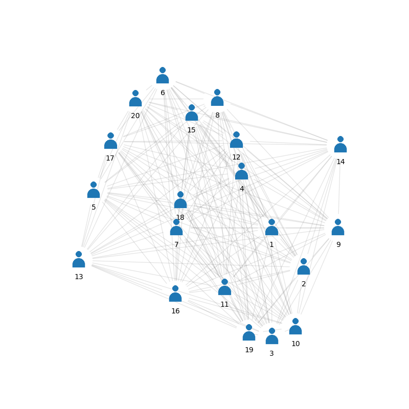{width=64%}

Items: $\{1, 2, \ldots, n\}$
:::

::: {.column width="2%"}
:::

::: {.column width="49%"}
{width=64%}
$$
\Del = (\del_{ij})_{1 \leq i,j \leq n} \in \Rnn
$$
:::

::::


## Multidimensional Scaling (MDS)

:::{.content-box-orange}
* Given pairwise dissimilarity data $\Del = (\del_{ij}) \in \Rnn$ and an **embedding dimension*** $p \ll n$
* Find a configuration of points $\{ \hx_1, \dots, \hx_n\} \in \Rp$ such that:

::: {.center}
$\displaystyle\| \hx_i - \hx_j \|^2 \approx \del_{ij} \quad \text{ for all } 1 \leq i,j \leq n$
:::
::: {.footnote .footnotesize}
*usually $p=2$ or $p=3$
:::
:::


::: {layout="[25, 5, 25, 5, 25]" layout-valign="center" .fragment}
{width="70%"}

$\longrightarrow$

{width="70%"}

$\longrightarrow$

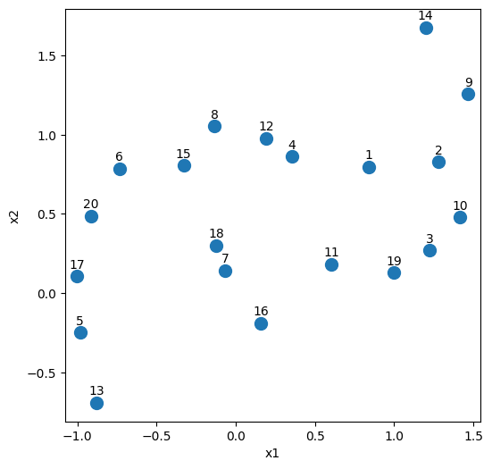{width="70%"}
:::


## Multidimensional Scaling (MDS) {visibility="uncounted"}

::::{.columns}

:::{.column width="60%" .center}
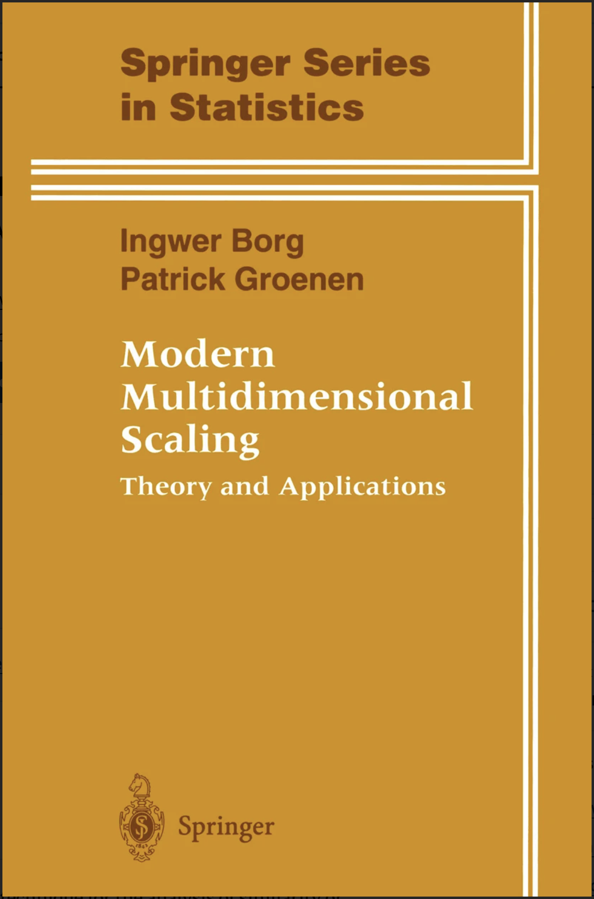{width="35%"}

{width="95%"}
:::

:::{.column width="40%" .center}
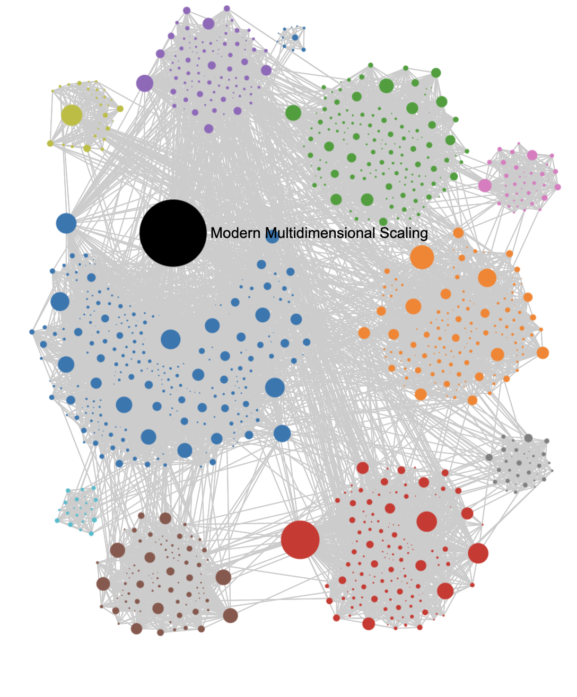{width="100%"}
:::


:::


## Classical MDS (CMDS) Algorithm {visibility="uncounted"}

:::::: {layout="[65, 35]" layout-valign="center"}


:::{.content-box-purple .small}
**Given:** dissimilarity matrix $\Del = (\del_{ij}) \in \Rnn$ and $p \ll n$

::: {.fragment .fade-in-then-semi-out fragment-index=1}
1. **Double centering:** +br 

::: {.center}
$\Delc = -\half H \Del H\quad$ where $\quad H = \Big(I_n - \frac{1}{n}\onev_n \onev_n\tr\Big)$
:::
:::

::: {.fragment .fade-in-then-semi-out fragment-index=2}
2. **Rank-p spectral decomposition:** 

::: {.center}
$\Delc = \hU \h\Lambda \hU\tr + \h V_{\perp} \h\Lambda_{\perp} \h V_{\perp}\tr$
:::
:::

::: {.fragment fragment-index=3}
3. **Spectral embedding:** 

::: {.center}
$\hX = \hU \h\Lambda^{1/2}$
:::
:::

**Output:** embedding $\hX \in \Rnp$
:::


:::: {.r-stack .center}


::: {.fragment .fade-out fragment-index=1}
{width="95%"}

$\Del \in \Rnn$
:::

::: {.fragment .fade-in-then-out fragment-index=1}
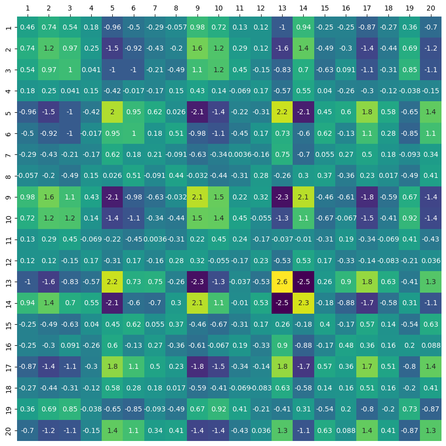{width="95%"}

$\Delc \in \Rnn$
:::


:::{.center .columns .fragment .fade-in-then-out fragment-index=2}
::: {.column width="30%"}
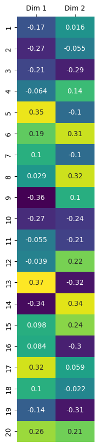{width="100%"}

$\hU \in \Rnp$
:::
::: {.column width="40%"}
:::
::: {.column width="30%"}
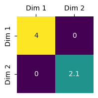{width="100%"}

$\hL \in \Rpp$
:::
:::


:::{.center .columns .fragment .fade-in fragment-index=3}
::: {.column width="30%"}
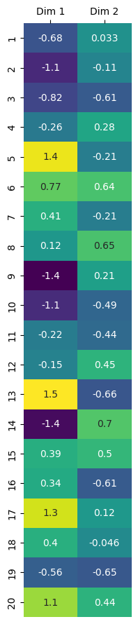{width="70%"}

$\hX \in \Rnp$
:::
::: {.column width="70%"}
{width="100%" scale=1.0}

:::
:::

::::

::::::

::: {.small}
Dates back to [@young1938discussion]. Later rediscovered by [@torgerson1952multidimensional] and [@gower1966some].
:::


## MDS vs Dimension Reduction {#appendix-mds-pca visibility="uncounted"}

| [Comparison]{.uva-orange} | MDS | Dimension Reduction+br+br |
|:----|:--------------------:|:-------------------------:|
| [Data type]{.uva-orange} | Pairwise dissimilarities $\Del \in \Rnn$ | Feature vectors $X \in \R^{n \times P}$+br+br+br |
| [Goal]{.uva-orange} | Find configuration $\hX \in \Rnp$ such that $\|\hx_i - \hx_j\| \approx \del_{ij}$ | Find low-dimensional representation $\hX \in \R^{n \times p}$ such that $\hx_i\tr\hx_j \approx x_i\tr x_j$ +br+br|
| [Spectral algorithm]{.uva-orange} | Classical MDS (CMDS) Algorithm $$\hX = 
\argmin_{Y \in \Rnp} \| \Delc - YY\tr \|_F^2$$ | Principal Component Analysis (PCA) $$\hX = \argmin_{Y \in \R^{n \times p}} \| X X\tr - YY\tr \|_F^2 $$ |
| [Nonlinear methods]{.uva-orange} | Isomap, t-SNE, Non-metric MDS, ... | Kernal PCA, LLE, Laplacian Eigenmaps, ... |


## Identifiability of MDS Embeddings

* In the **realizable setting**, there exists a [**latent configuration**]{.green} $\color{green}{x_1, \dots, x_n} \in \Rp$ such that $\color{green}{\del_{ij} = \|x_i - x_j\|^2}$

* Let $\color{green}{\X} \in \Rnp$ be the [**configuration matrix**]{.green}

* For any [**rigid transformation**]{.orchid} $g \in \euc$ (i.e., rotation + reflection + translation), &nbsp;&nbsp; [$\color{green}{\Del\big(\XGreen\big)} \equiv \color{green}{\Del\big(}\color{magenta}{g}(\color{green}{X)\big)}$]{}


::::: {.r-stack}


:::: {.fragment .fade-out fragment-index=1}
:::: {.columns}

::: {.column width="50%" style="margin-top: -2%;"}
{width="70%"}
:::
::: {.column width="50%"}
```{ojs}
// Load libraries
d3 = require("d3@7")
Plot = require("@observablehq/plot@0.6")
Inputs = require("@observablehq/inputs")

// Original coordinates
X = [
  [ 1.14623781,  0.1538715 ],
  [ 1.52213386, -0.08244349],
  [ 1.14854378, -0.50119446],
  [ 0.79205965,  0.49071824],
  [-0.94213814,  0.37757528],
  [-0.13194707,  1.06805394],
  [ 0.03096746,  0.154996  ],
  [ 0.50951258,  0.93249084],
  [ 1.92567077,  0.15466052],
  [ 1.42509235, -0.4438636 ],
  [ 0.59488429, -0.20794035],
  [ 0.72922735,  0.68034407],
  [-1.11931582, -0.04090519],
  [ 1.95532585,  0.65242416],
  [ 0.20594816,  0.84546606],
  [ 0.01612213, -0.24717725],
  [-0.74877507,  0.67520749],
  [ 0.07458595,  0.31634168],
  [ 0.88279825, -0.48225769],
  [-0.45268068,  0.93194446]
]

// Sliders — no labels
viewof theta = Inputs.range([0, 2 * Math.PI], { value: 0, step: 0.01 })
viewof mu    = Inputs.range([-2, 2],         { value: 0, step: 0.1 })

// Transform points
transformed = {
  const cosT = Math.cos(theta);
  const sinT = Math.sin(theta);
  return X.map(([x0, y0]) => {
    const xRot = cosT * x0 - sinT * y0;
    const yRot = sinT * x0 + cosT * y0;
    return { x: xRot + mu, y: yRot + mu };
  });
}

// Reference points as "x", transformed as circles
Plot.plot({
  width: 690,
height: 450,
x: { domain: [-1.5, 2.5] },
y: { domain: [-1, 1.5] },
  marks: [
    Plot.frame(),

    // Larger red "x"
    Plot.text(
      X.map(([x, y]) => ({ x, y, label: "x" })),
      { 
        x: "x",
        y: "y",
        text: "label",
        fill: "red",
        fontSize: 20,     // increase size
        fontWeight: "bold"
      }
    ),

    // Moving configuration
    Plot.dot(transformed, { x: "x", y: "y", r: 4, fill: "blue" })
  ]
})
```
:::
::: {.column width="10%"}
:::
::::
::::


:::: {.fragment .fade-in fragment-index=1}

::: {.content-box-dblue}

**Theorem [@young1938discussion; @schoenberg1935remarks].** 

In the [realizable setting]{}, the **CMDS algorithm exactly recovers** the [latent configuration]{.green} up to [rigid transformations]{.orchid}, i.e.,

$$
\mds\big(\; \color{green}{\DelXGreen}, p\;\big) = \color{magenta}{g}(\color{green}{X}) \quad \text{ for some } \color{magenta}{g} \in \euc
$$

:::

[(a [short proof](#appendix-why-cmds-works) is in the appendix)]{.footnotesize}

::::


:::::


## MDS under noise

:::{.content-box-grey}
In practice, the dissimilarity data is often subject to [**noise**]{.uva-orange} and/or [**measurement errors**]{.uva-orange}, i.e., we observe:
$$
\begin{aligned}
d_{ij} &= \color{green}{\del_{ij}} + \color{red}{\eps_{ij}}\\
D &= \underbrace{\color{green}{\Del}}_{\color{green}{\text{signal}}} + \underbrace{\color{red}{\Eps}}_{\color{red} {\text{noise}}}
\end{aligned}
$$
:::

::: {layout="[25, 5, 25, 5, 25]" layout-valign="center"}

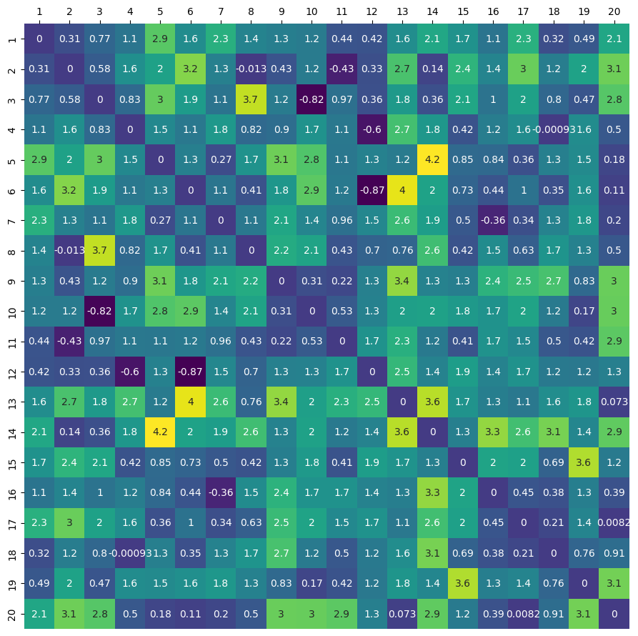{width="70%"}

$=$

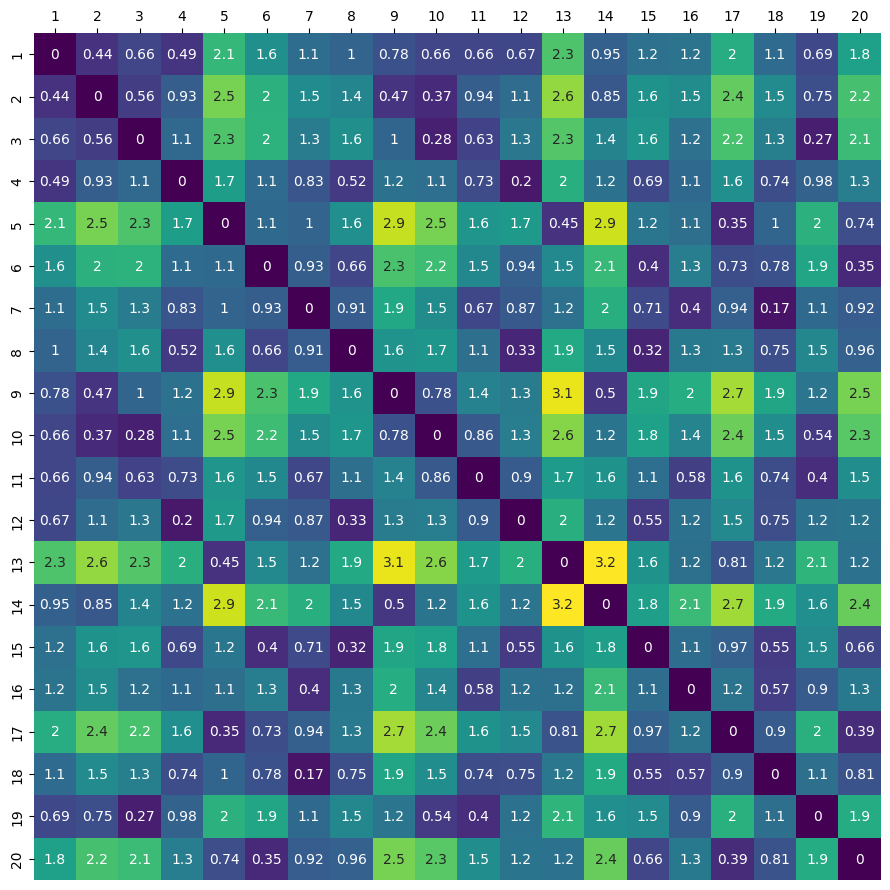{width="70%"}

$+$

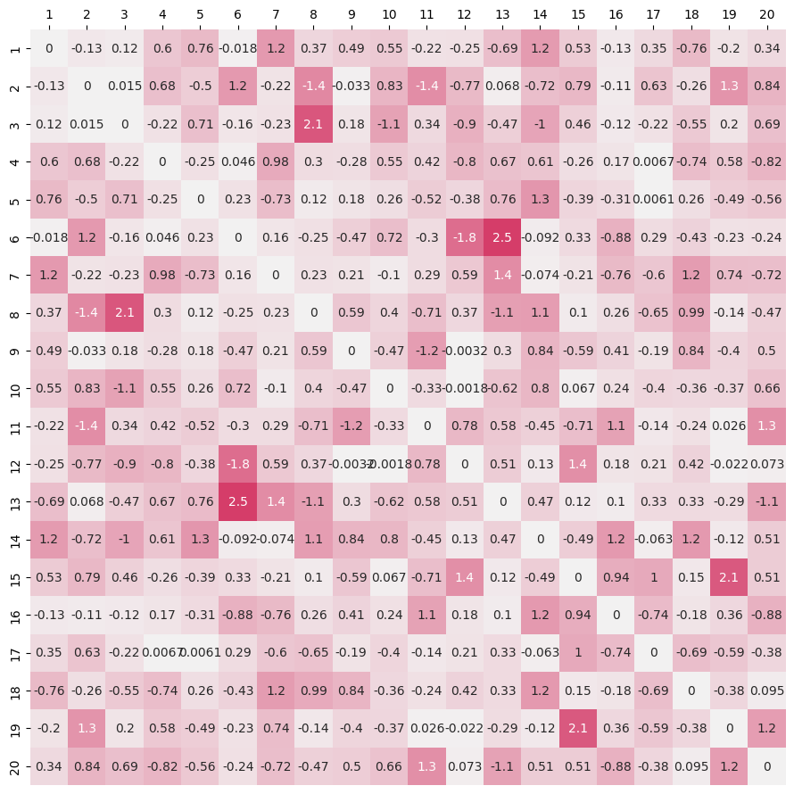{width="70%"}

:::


## MDS under noise {visibility="uncounted"}

:::{.content-box-grey}
In practice, the dissimilarity data is often subject to [**noise**]{.uva-orange} and/or [**measurement errors**]{.uva-orange}, i.e., we observe:
$$
\begin{aligned}
d_{ij} &= \color{green}{\del_{ij}} + \color{red}{\eps_{ij}}\\
D &= \underbrace{\color{green}{\Del}}_{\color{green}{\text{signal}}} + \underbrace{\color{red}{\Eps}}_{\color{red} {\text{noise}}}
\end{aligned}
$$
:::


:::: {.columns}

:::{.column width="60%"}
+br+br

:::{.content-box-orange}
* $\XGreen$ is the configuration matrix underlying the [signal $\Del$]{.green}
* $\hX = \mds(D, p)$ is the CMDS embedding of $D$

The [**noisy CMDS embedding**]{.uva-orange} $\hX$ reflects the variability in $D$ due to $\color{red}{\Eps}$
:::
:::
::: {.column width="40%" .center}
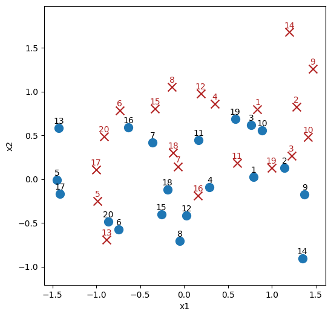{width="70%"}
:::

::::


## Example - 1


Suppose $n$ sensors are placed in various locations across the United States, and
$$
d_{ij} = \color{red}{\text{noisy}} \text{ squared Euclidean distance between sensors $i$ and $j$}
$$

::::{.columns}
:::{.column width="40%" .center}
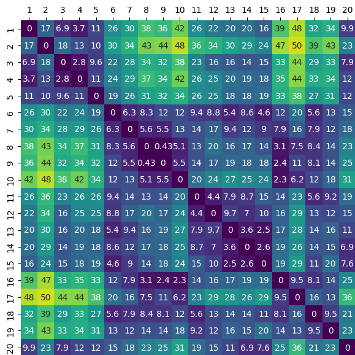{width="90%"}
:::
:::{.column width="60%"}
**Are the sensors placed in the following locations?**

* San Diego, CA
* Phoenix, AZ
* $\dots$
* Washington, DC

::: {.content-box-solid-lightorange .center .footnotesize .fragment}
$$
\pr\Big( \text{locations}(d_{ij}) \simeq \{\text{San Diego}, \dots, \text{Washington DC}\} \Big)?
$$
:::
:::

::::


## Example - 1 {visibility="uncounted"}


```{python}
import plotly.graph_objects as go
import numpy as np

# your matrix
pts = np.array([
  [33.395451954774344, -116.56439161038234],
[48.108025710076475, -122.92849274278078],
[34.02461082128876, -112.71933666708098],
[35.61729882163741, -114.72833547890279],
[45.85967498821038, -109.49033666914245],
[38.37289482050906, -90.24731696226311],
[42.228117661145966, -87.1895050727579],
[41.375254336650364, -82.52162610658272],
[40.27227181552411, -81.31719495644117],
[41.080749321883864, -73.2409874547851],
[29.799471507417657, -87.93195684760049],
[29.804262181778334, -96.26280221549924],
[32.255403145659265, -97.63920129263443],
[34.86077879074841, -97.48276955656243],
[37.55028764727703, -98.50201856867726],
# [38.669659368654706, -78.72114542890988],
[38.5293, -76.3767],
[42.198688371914685, -72.50471116858739],
[33.37589451879909, -82.33537390544765],
[28.66713158331832, -82.40762693948109],
[35.50496894714642, -105.32059009034614],
[39.311036495683894, -103.23348820810236],
[40.37184108073199, -113.49645343304725],
[38.151089336480155, -122.23163700966431],
[41.379564699954805, -106.00341934279291],
[40.96859401421174, -94.56363956247374],
[45.33417319402169, -94.1289712611423],
[36.210756845201466, -86.66439950758569],
[31.910335493320844, -78.73442885210514],
[32.16531293340556, -105.36009678147337],
[35.05389959257307, -93.93624630674735],
])

cities = {
    "San Diego": (32.7157, -117.1611),
    "Seattle": (47.6062, -122.3321),
    "Phoenix": (33.4484, -112.0740),
    "Las Vegas": (36.1699, -115.1398),
    "Bozeman": (45.6760, -111.0429),
    "St Louis": (38.6270, -90.1994),
    "Chicago": (41.8781, -87.6298),
    "Cleveland": (41.4993, -81.6944),
    "Pittsburgh": (40.4406, -79.9959),
    "New York": (40.7128, -74.0060),
    "New Orleans": (29.9511, -90.0715),
    "Houston": (29.7604, -95.3698),
    "Dallas": (32.7767, -96.7970),
    "Oklahoma City": (35.4676, -97.5164),
    "Wichita": (37.6872, -97.3301),
    # "Charlottesville": (38.0293, -78.4767),
    "Washington, DC": (38.9072, -77.0369),
    "Boston": (42.3601, -71.0589),
    "Atlanta": (33.7490, -84.3880),
    "Orlando": (28.5383, -81.3792),

    # New additions
    "Santa Fe": (35.6870, -105.9378),
    "Denver": (39.7392, -104.9903),
    "Salt Lake City": (40.7608, -111.8910),
    "San Francisco": (37.7749, -122.4194),
    "Cheyenne": (41.1400, -104.8202),
    "Omaha": (41.2565, -95.9345),
    "Minneapolis": (44.9778, -93.2650),
    "Nashville": (36.1627, -86.7816),
    "Charleston": (32.7765, -79.9311),
    "El Paso": (31.7619, -106.4850),
    "Little Rock": (34.7465, -92.2896)
}

lats = [cities[c][0] for c in cities]
lons = [cities[c][1] for c in cities]
labels = list(cities.keys())

fig = go.Figure()

a = 240
fig.update_layout(
    geo=dict(
        scope="usa",
        projection=go.layout.geo.Projection(type="albers usa"),
        showland=True,
        landcolor=f"rgba({a}, {a}, {a}, 1.0)",
        showsubunits=True,
        subunitcolor="black",   # state border color
        subunitwidth=1
    )
)

fig.add_trace(go.Scattergeo(
    lat=pts[:,0],
    lon=pts[:,1],
    mode="markers",
    marker=dict(
        symbol="circle",
        size=10,
        color="black",
        line=dict(width=1, color="black")
    ),
    hoverinfo="skip"        # disables hover
))

fig.add_trace(go.Scattergeo(
    lon=lons,
    lat=lats,
    text=labels,
    mode="markers+text",
    textposition="top center",
    textfont=dict(
        size=16,
    ),
    marker=dict(
        size=10,
        symbol="x",
        color="red",
        line=dict(width=0.01, color="red")
    ),
    hoverinfo="skip"        # disables hover
))

fig.update_geos(
    lataxis=dict(range=[24, 50]),
    lonaxis=dict(range=[-125, -66])
)
# adjust figure size


fig.show()
```


<p></p>
::: {.content-box-solid-lightorange .center}
$\pr(\displaystyle\hX\; {\cong}\;\XGreen)?$
:::


## Example - 2

Senators' voting records in the 116th U.S. Congress from 2019--2021 [@lewis2019voteview]
$$
d_{ij} = \% \text{disagreement between senators $i$ and $j$ on roll-call votes}
$$
$D = (d_{ij}) \in \R^{100 \times 100}$ and let $\hX = \mds(D, 2) \in \R^{100 \times 2}$ be the  embedding


::: {.fragment}
```{python}
import plotly.express as px
import pandas as pd
import numpy as np
# read distance matrix D from data/senate_116_D.csv
# no header
df = pd.read_csv("data/senate_116_D.csv", header=None)
# read df_codes from data/senate_116_df_codes.csv
df_codes = pd.read_csv("data/senate_116_df_codes.csv")
# read X from data/senate_116_X.csv
X = pd.read_csv("data/senate_116_X.csv", header=None)
# read Sigmas from data/senate_116_Sigmas.json each as numpy array
import json
with open("data/senate_116_Sigma.json", "r") as f:
    Sigmas = json.load(f)
    Sigmas = [np.array(Sigma) for Sigma in Sigmas]
# scatterplot of X colored by party from df_codes
# white background + no grid + no colorbar + binary colors for 3 party codes
# red for 200 (Republican), blue for 200 (Republican), purple for 328 (Independent)
# hover info shows "bioname" from df_codes
cls = ['red' if p == 200 else 'dodgerblue' if p == 100 else 'purple' for p in df_codes['party_code']]


plot_df = pd.DataFrame({
    "x": X[0],
    "y": X[1],
    "party_code": pd.Categorical(df_codes["party_code"]),
    "bioname": df_codes["bioname"],
})

fig = px.scatter(
    plot_df,
    x="x", y="y",
    color="party_code",
    color_discrete_map={100: "dodgerblue", 200: "red", 328: "purple"},
    hover_name="bioname",
    hover_data={},  # remove all other hover fields
)

# show ONLY the bioname (and remove the extra trace-name line)
fig.update_traces(hovertemplate="%{hovertext}<extra></extra>")

fig.update_traces(hoverlabel_font_size=20, marker=dict(size=15))
fig.update_layout(template="simple_white", showlegend=False)
fig.update_xaxes(showgrid=False)
fig.update_yaxes(showgrid=False)
fig.update_layout(title_text="US Congress #116 - Senate (2019 - 2021)", title_x=0.5)

fig.show()
```
:::


# Signal Recovery

## Desiderata - I (Signal Recovery)


::::{.columns}

:::{.column width="65%"}
* Let $D = \DelXGreen + \EpsRed$ and 
$\hX = \mds(D, p)$

::: {.fragment fragment-index=1}
* For any metric $\|\hX - \XGreen\|_{\dagger}$, define the [**reconstruction error***]{.uva-orange}:

:::{.center}
$\displaystyle\ell(\hX, \XGreen) = \min_{g \in \euc} \| g(\hX) -\XGreen\|_{\dagger}$
:::
:::

::: {.fragment fragment-index=2}
:::{.content-box-orange}
**1.** Can we recover the signal with high probability? i.e.,+br

$$
\pr \Big(\; \ell(\hX,\XGreen) \lesssim R_n \;\Big) \geq 1 - \alpha_n \quad \text{ for } R_n, \alpha_n \to 0
$$
<p></p>
<p></p>

**2.** How do the configuration $\XGreen$ and the noise $\EpsRed$ impact $\ell(\hX,\XGreen)$?+br+br

**3.** Can we do better than the CMDS algorithm?
:::
:::
:::


:::{.column width="35%" .center .fragment fragment-index=1}
+br
```{ojs}
// New Y coordinates
Y = [
[ 0.29082279,  1.2197497  ],
[ 0.54921743,  1.48447509 ],
[ 0.79487358,  0.91690786 ],
[-0.05507621,  0.8399228  ],
[-0.81007186, -0.729762   ],
[-0.96725007,  0.1586658  ],
[ 0.0870127 ,  0.02126686 ],
[-0.75285017,  0.83506472 ],
[ 0.3896396 ,  1.83058711 ],
[ 0.80195523,  1.0558289  ],
[ 0.36033686,  0.47377509 ],
[-0.46475696,  0.76321042 ],
[-0.27488389, -0.99563331 ],
[-0.26321777,  2.15651646 ],
[-0.58762755,  0.50281184 ],
[ 0.10823995, -0.29860396 ],
[-0.93214625, -0.62583634 ],
[-0.30831587,  0.43091851 ],
[ 0.77425273,  0.72337579 ],
[-0.94726912,  0.01034496 ]
]

// Single slider: rotation angle
viewof theta2 = Inputs.range([0, 2 * Math.PI], { value: 0, step: 0.01 })
viewof mu1    = Inputs.range([-2, 2], { value: 0, step: 0.1 })
viewof mu2    = Inputs.range([-2, 2], { value: 0, step: 0.1 })


// Rotate Y (no translation)
rotatedY = {
const cosT = Math.cos(theta2);
const sinT = Math.sin(theta2);
return Y.map(([x0, y0]) => ({
x: cosT * x0 - sinT * y0 + mu1,
y: sinT * x0 + cosT * y0 + mu2
}));
}

// Plot: X as fixed red "x", rotated Y as dots
Plot.plot({
width: 530,
height: 500,
x: { domain: [-1.5, 2.5] },
y: { domain: [-1, 1.5] },
marks: [
Plot.frame(),


// Fixed reference configuration X
Plot.text(
  X.map(([x, y]) => ({ x, y, label: "x" })),
  {
    x: "x",
    y: "y",
    text: "label",
    fill: "red",
    fontSize: 20,
    fontWeight: "bold"
  }
),

// Rotated Y configuration
Plot.dot(rotatedY, { x: "x", y: "y", r: 4, fill: "blue" })
]
})
```
:::

::::

::: {.footnote .footnotesize .fragment fragment-index=1}
*modulo rigid transformations
:::


## Statistical Estimation and difficulties {auto-animate="false"}

* [**Model:**]{.uva-orange}+br+br 
$D = \DelXGreen + \EpsRed$ where $\EpsRed = (\color{red}{\eps_{ij}}) \in \Rnn$ is a **symmetric** and **hollow** $n \times n$ random matrix

* [**Parameters:**]{.uva-orange}+br+br
$\XGreen \in \Rnp$ (configuration matrix underlying $\DelGreen$) [**which consists of $np$ unknown parameters!**]{}

::: {.center .fragment fragment-index=1}
As $n \uparrow$ &emsp; then &emsp; $\#$parameters = $np\!\uparrow$ too!
:::

::: {.fragment fragment-index=2}
* [**Observations**:]{.uva-orange}+br+br
We have a total of $N = \binom{n}{2}$ observations $\big\{\del_{ij}: i < j\big\}$
:::


## Assumptions on [$\XGreen$]{.smaller} and [$\EpsRed$]{.smaller} {auto-animate="true" data-transition="linear"}

::: {.content-box-grey}
$\XGreen \in \bbX(\params)$ where $\bbX(\params) \subset \Rnp$ is the set of configurations satisfying:

1. **Bounded condition number:** $\hspace{1em}$ $\kappa\inv \le s_p\left(\tfrac{\XGreen}{\sqrt{n}}\right) \le s_1\left(\tfrac{\XGreen}{\sqrt{n}}\right) \le \kappa$

2. **Compactly supported:** $\hspace{4.5em}$ $\ttinf{\XGreen} \le \Rx$
:::

+br


::: {.fragment}
::: {data-id="cbox1" .content-box-grey style="width: 100%;"}
::: {data-id="eps-content"}
$\EpsRed = (\color{red}{\eps_{ij}})$ is a random symmetric hollow matrix with:

1. **Independence:** $\hspace{1em}$ $(\color{red}{\eps_{ij}})$ are independent for $i < j$ with $\E(\color{red}{\eps_{ij}}) = 0$ and $\Var(\color{red}{\eps_{ij}}) = \sigma_{ij}^2$
2. **Finite $q$th moment:** $\hspace{1em}$ For $q > 4$, $\hspace{1em}$ $\displaystyle\max_{i < j}\norm{\color{red}{\eps_{ij}}}_{L^q} \le \sigma$
:::
:::
:::


## Assumptions on [$\XGreen$]{.smaller} and [$\EpsRed$]{.smaller} {visibility="uncounted" auto-animate="true" data-transition="linear"}


::: {data-id="cbox1" .content-box-grey style="width: 100%;"}
::: {data-id="eps-content"}
$\EpsRed = (\color{red}{\eps_{ij}})$ is a random symmetric hollow matrix with:

1. **Independence:** $\hspace{1em}$ $(\color{red}{\eps_{ij}})$ are independent for $i < j$ with $\E(\color{red}{\eps_{ij}}) = 0$ and $\Var(\color{red}{\eps_{ij}}) = \sigma_{ij}^2$
2. **Finite $q$th moment:** $\hspace{1em}$ For $q > 4$, $\hspace{1em}$ $\displaystyle\max_{i < j}\norm{\color{red}{\eps_{ij}}}_{L^q} \le \sigma$
:::
:::


$$
\begin{aligned}
d_{ij} &= \color{green}{\del_{ij}} + \color{red}{\xi_{ij}} &&\hspace{3em} (\text{additive})\\
d_{ij} &= \color{green}{\del_{ij}} + \color{red}{\del_{ij}\xi_{ij}} &&\hspace{3em} (\text{multiplicative})\\
\log d_{ij} &= \log \color{green}{\del_{ij}} + \color{red}{\xi_{ij}} &&\hspace{3em} (\text{log-Normal})\\
d_{ij} &= \color{green}{\del_{ij}} + \color{red}{2\del_{ij}\xi_{ij} + \xi_{ij}^2} &&\hspace{3em} (\text{absolute additive})\\
\end{aligned}
$$
where ${\Xi = (\xi_{ij})}$ is a random matrix with iid entries


## Signal recovery {auto-animate="false" align="center"}

For $\XGreen \in \bbX(\params)$ and $D = \DelXGreen + \EpsRed$, let $\hX = \mds(D, p)$.

::: {.content-box-dblue}
**Definition (CMDS Upper Bound).** The reconstruction error $\ell(\hX,\XGreen)$ has:

* [**convergence rate**]{.uva-orange} $R_n \to 0$ 
* with [**failure probability**]{.uva-orange} $\alpha_n \to 0$, if:

$$
\sup_{D = \DelXGreen + \EpsRed}\pr\Big(\;\; \ell(\hX,\XGreen) \lesssim R_n \;\;\Big) \geq 1 - \alpha_n
$$
:::


## Can we do better than CMDS? {data-auto-animate="true" align="center"}

Let $\hXc(D) \in \Rnp$ be [**any estimator**]{.uva-orange} of $\XGreen$ &nbsp; based on $D = \DelXGreen + \EpsRed$ &nbsp; &nbsp; and for $\XGreen \in \bbX(\params)$


:::: {.r-stack}

::: {.content-box-dblue .fragment fragment-index=1 .fade-in-then-out}
**Definition (Lower Bound).** 

$r_n \to 0$ is a [**lower bound**]{} for the reconstruction error $\ell(\hXc,\,\XGreen)$ if:

$$
\sup_{D = \DelXGreen + \EpsRed}\pr\Big(\;\; \ell(\hXc,\,\XGreen) \gtrsim r_n \;\;\Big) \ge \frac{1}{2}
$$
:::

::: {.content-box-dblue .fragment fragment-index=2 .fade-in}
**Definition ([**Minimax**]{.uva-orange} Lower Bound).** 

$r_n \to 0$ is a [**minimax**]{.uva-orange} [**lower bound**]{} for the reconstruction error $\ell(\hXc,\,\XGreen)$ if:

$$
\inf_{\hXc} \sup_{D = \color{green}{\Del} + \EpsRed } \pr\Big(\;\; \ell(\hXc,\,\XGreen) \gtrsim r_n\;\; \Big) \ge \frac{1}{2}
$$
:::


::::


+br

::: {.center .fragment fragment-index=2 .fade-down}
Performance of the best conceivable estimator $\displaystyle\Big(\text{i.e., }\inf_{\hXc}\Big)$ on the most difficult instance $\displaystyle\Big(\text{i.e., }\sup_{D = \color{green}{\Del} + \EpsRed }\Big)$
:::


## Reconstruction error metrics

:::{.content-box-grey}
The [**reconstruction error**]{.uva-orange} between the CMDS embedding $\hX$ and the true configuration $\XGreen$ is:
$$
\ell(\hX,\XGreen) = \min_{g \in \euc} \| g(\hX) -\XGreen\|_{\dagger}
$$
:::


* **RMSE:**+br $\hspace{10em}$ $\displaystyle\frac{1}{\sqrt{n}}\norm{g(\hX) - X}_F = \sqrt{\frac{1}{n}\sum_{i=1}^n \norm{g(\hx_i) - x_i}_2^2}$

<!-- * **$\ell_2$-operator norm:**+br $\hspace{10em}$ $\displaystyle\norm{g(\hX) - X}_2 = \max_{v \in \mathbb{S}^{p-1}} \norm{(g(\hX) -\XGreen)v}_2$ -->

* **$\ell_{\ttinft}$-operator norm:**+br $\hspace{10em}$ $\displaystyle\norm{g(\hX) - X}_{\ttinft} = \max_{i \in [n]} \norm{g(\hx_i) - x_i}$


## 

<!-- ::: {.center .small style="margin-top: -1%;" .fragment fragment-index=1 .semi-fade-out}
Let $\hX = \mds(D, p)$ &emsp; for &emsp;  $D = \DelXGreen + \EpsRed$ &emsp;and&emsp; $\XGreen \in \bbX(\params)$ 
::: -->

::: {.content-box-gray .center .footnotesize style="margin-top: -1.2%" .fragment fragment-index=1 .semi-fade-out}

| [Minimax Lower Bound]{.large .uva-orange} | &emsp;&emsp;&emsp;&emsp; | [CMDS Upper Bound]{.large .uva-orange} |
|:-------------------------------:|:---:|:-------------------------------:|
| $\displaystyle \inf_{\hXc} \sup_{D = \DelXGreen + \EpsRed } \pr\Big(\;\; \ell(\hXc,\,\XGreen) \gtrsim r_n\;\; \Big) \ge \frac{1}{2}$ | | $\displaystyle \sup_{D = \DelXGreen + \EpsRed }\pr\Big(\;\; \ell(\hX, \XGreen) \lesssim R_n \;\;\Big) \;\ge\; 1 - \alpha_n$ |
:::

<p></p>


::: {.content-box-orange .small .fragment fragment-index=1 style="margin-top: 0%;"}

**Theorem [@vishwanath2025minimax].** &emsp; For all &emsp; $0 < r < \frac{q-4}{2}$:+br
<p></p>

| [Metric]{.uva-orange} | [Lower bound $r_n$]{.uva-orange} | &emsp;&emsp; | [Upper bound $R_n$]{.uva-orange}| &emsp;&emsp; | [ Failure Probability $\alpha_n$]{.uva-orange} |
|:---------------------:|:-------------------------------:|:---:|:-------------------------------:|:---:|:-------------------------------:|
| [$$\ell_{\text{RMSE}}$$]{} | $\displaystyle\frac{\sigma\kappa}{\sqrt{n}}$ | | $\displaystyle\frac{\sigma\kappa}{\sqrt{n}}$ +br | | $O(n^{-2} + n^{-r})$ |
| [$\ell_{\ttinft}$]{} | $\displaystyle\underline{c}(\params)\cdot \sigma\sqrt{\frac{\log{n}}{n}}$| | $\displaystyle\bar{c}(\params)\cdot \sigma\sqrt{\frac{\log{n}}{n}}$| | $O(n^{-2} + n^{-r})$ +br+br |
<p></p>
<p></p>
:::

::: {.small .fragment fragment-index=2 .fade-down}
* $q > 4$ moments is [necessary]{.uva-orange} for consistency
* Parametric rates (in $n$) for $\ell_{\text{RMSE}}$ and minimax-optimal up to absolute constants
* Extra [$\sqrt{\log{n}}$]{.small} factor for $\ell_{\ttinft}$ is unavoidable and suggests extreme-value phenomena
:::

::: {.footnote .footnotesize .fragment fragment-index=1 .fade-in-then-semi-out}
where &nbsp; $\bar{c}(\params) = \kappa^2(\kappa + \Rx)$ &emsp; and &emsp; $\underline{c}(\params) = \kappa(1+\kappa\Rx)\inv$.
:::


## Illustration

::: {.center .r-stack}
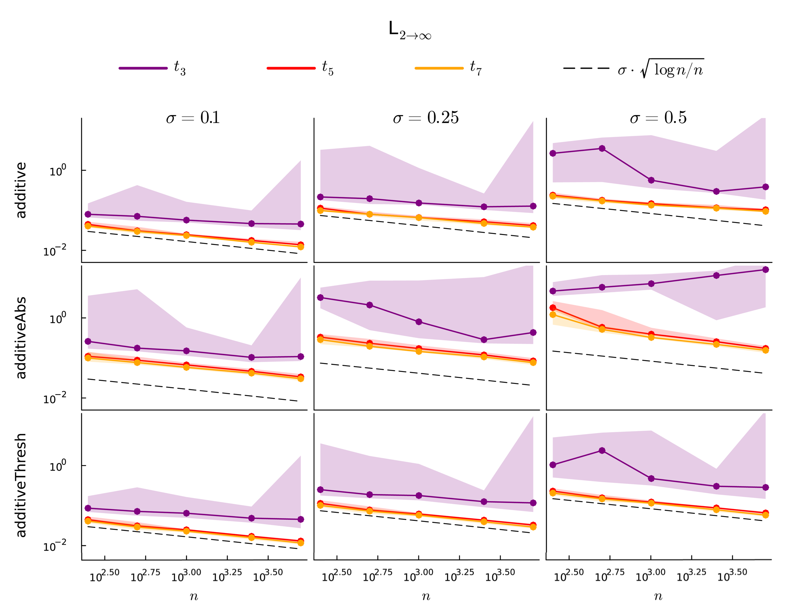{width=55% .fragment .fade-out fragment-index=1}

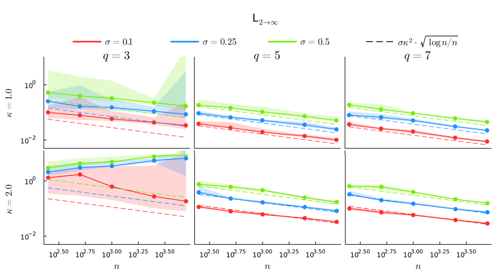{width=98% .fragment .fade-in fragment-index=1}
:::

::: {.footnote .scriptsize}
More [experiments in the appendix](#appendix-fourth-moment-plots)
:::


## Under the hood: Procrustes alignment

For each reconstruction error $\ell_{\text{RMSE}}, \ell_2$ and $\ell_{\ttinft}$, we have **a different choice** of the optimal $g \in \euc$

::: {.footnotesize}

| [$\ell(\hX,\XGreen)$]{.uva-orange} | [$\displaystyle\widehat{g} = \argmin_{g \in \euc} \| g(\hX) -\XGreen\|_{\dagger}$]{.uva-orange} |
|:---------------------:|:-------------------------------:|
| $\ell_{\text{RMSE}}$ | $\displaystyle\widehat{g} = \argmin_{g \in \euc}\|g(\hX) - \XGreen\|_F$ |
| $\ell_{\ttinft}$ | $\displaystyle\widehat{g} = \argmin_{g \in \euc}\|g(\hX) - \XGreen\|_{\ttinft}$ |
:::

+br

::: {.fragment .content-box-dblue .small}
**Orthogonal Procrustes Problem.** For $\XGreen, Y \in \Rnp$ the solution to $\color{magenta}{\hgc = \argmin_{g \in \euc}\|g(Y) - \XGreen\|_F}$ is:
$$
\hgc(v) = Ov + \mu
$$
where $\mu = (\bar{x} - O\bar{y})$ and $O \in \mathcal{O}(p)$ is given by $O = W_1W_2\tr$ where
$$
W_1 S W_2\tr = \text{svd}(Y\tr\XGreen)
$$
:::


## Under the hood: Procrustes alignment {visibility="uncounted"}

All the upper bounds are proved using $\hgc$ obtained from the [orthogonal Procrustes solution]{.uva-orange}, e.g.,
$$
\begin{aligned}
\ell_{\ttinft}(\hX,\XGreen) &= \min_{g \in \euc}\|g(\hX) - \XGreen\|_{\ttinft}  \\
&\color{magenta}{\le} \bbox[yellow]{\| \hgc(\hX) -\XGreen\|_{\ttinft} \;\lesssim\; \bar{c}(\params)\cdot \sigma\sqrt{\frac{\log{n}}{n}}}
\end{aligned}
$$

+br


::: {.content-box-dblue .small}
**Orthogonal Procrustes Problem.** For $\XGreen, Y \in \Rnp$ the solution to $\color{magenta}{\hgc = \argmin_{g \in \euc}\|g(Y) - \XGreen\|_F}$ is:
$$
\hgc(v) = Ov + \mu
$$
where $\mu = (\bar{x} - O\bar{y})$ and $O \in \mathcal{O}(p)$ is given by $O = W_1W_2\tr$ where
$$
W_1 S W_2\tr = \text{svd}(Y\tr\XGreen)
$$
:::


## Under the hood: Fuk-Nagaev-Type concentration


Let $\Eps = (\eps_{ij})$ be an $n \times n$ random matrix where each row $\eps_{i, *}$ consists of independent entries. Let $X \in \Rnp$ be fixed.

:::: {.fragment fragment-index=1 .semi-fade-out}
:::{.content-box-dblue .small}
**Bernstein-Type Concentration.** &emsp; If [$\max_{i,j}|{\eps_{i,j}|} \le K$ a.s.]{.magenta}, then with probability greater than $1 - O({e^{-t}})$,
$$
\norm{\Eps X}\ttinft \lesssim \sigma_2 \sqrt{n (t + \log{p})} + K (t + \log{p})
$$
:::
::::

+br

:::: {.fragment fragment-index=1 .fade-in}
:::{.content-box-orange .small}
**Fuk-Nagaev-Type Concentration [@vishwanath2025minimax]** &emsp; Suppose [$\max_{i,j}\|{\eps_{i,j}\|_{L^q}} \le \sigma$ for $q > 4$]{.magenta}+br Then, for all $0 < r < \frac{(q-4)}{2}$, with probability greater than $1 - O({e^{-t}} + {n^{-r}})$,
$$
\norm{\Eps X}\ttinft \lesssim \sigma_2 \sqrt{n (t + \log{p})} + \sigma n^{(r+2)/q} (t + \log{p})
$$
:::
::::

::: {.footnote .footnotesize}
$\sigma_2 = \max_{i,j} \|{\eps_{ij}}\|_{L^2}$+br
[Operator norm version in the appendix](##appendix-fuk-nagaev)
:::


# Uncertainty Quantification


## Desiderata - II (Uncertainty Quantification)


::::{.columns}

:::{.column width="63%" .center}
:::{}
* Let $\XGreen \in \Rnp$ and $D = \DelGreen + \EpsRed$ and 
$\hX = \mds(D, p)$
:::

::: {.fragment fragment-index=1}
:::{.content-box-gray}
* For any $\color{Goldenrod}{\boldsymbol{\alpha}} \in (0, 1)$
* Can we construct $\color{Goldenrod}{\boldsymbol{100 \times (1-\alpha)\%}}$ [**_uniform_ confidence sets**]{.uva-orange} 
$$
\conf_{\alpha} = \prod_{i=1}^n \conf_{\alpha, i} \subset \Rp
$$
which provide [**simultaneous coverage***]{.purple} of the true configuration:
$$
\boxed{\phantom{\Bigg()} \pr \Big( \exists g \in \euc: \; g(\color{green}{x_i}) \in \conf_{\alpha, i} \;\;\; \color{Purple}{\forall i \in [n]} \Big) \approx \color{Goldenrod}{\boldsymbol{1 - \alpha}} \phantom{\Bigg()}}
$$
:::
:::

:::


:::{.column width="37%" .center .fragment fragment-index=1}
+br
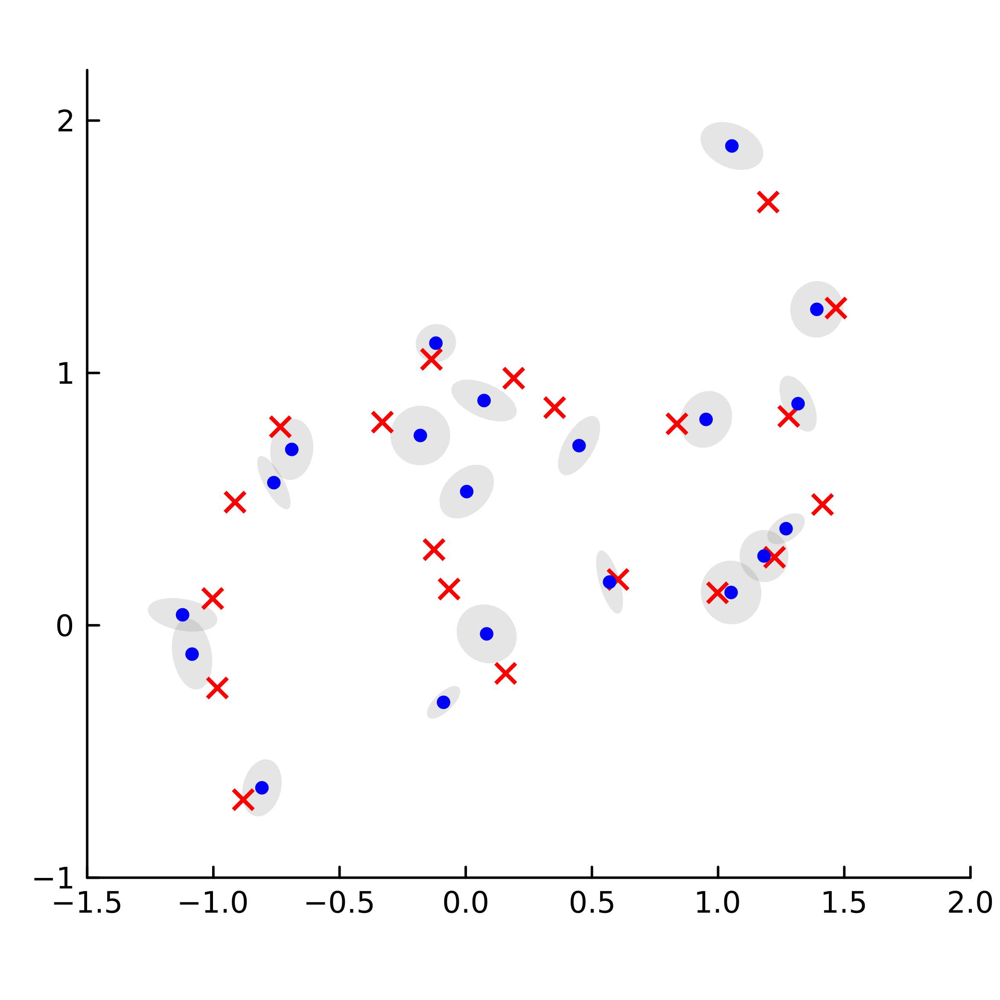{width="100%"}
:::

::::

::: {.footnote .footnotesize .fragment fragment-index=1}
*modulo rigid transformations
:::


## Tail bounds don't suffice

::: {.center}
[Let $\XGreen \in \bbX(\params)$ and $D = \DelGreen + \EpsRed$, and let $\hX = \mds(D, p)$]{.footnotesize}
:::


:::: {.r-stack}

::: {.footnotesize .content-box-gray .fragment .fade-out fragment-index=1}
[**Tail bound.** ]{.uva-orange}  The constant $\color{red}{C_1}$ is unknown and is going to be **too conservative for practical use**

$$
\begin{aligned}
&\pr\bigg( \ttinf{\hX - \hg(X)} \ge \color{red}{C_1} \;\cdot\; \underline{c}(\params) \sigma\;\cdot \sqrt{\tfrac{t + \log{n}}{n}} \bigg) \le e^{-t}\\
\phantom{\implies}
&\phantom{\pr\bigg( \ttinf{\hX - \hgc(X)} \le \color{red}{C_1} \;\cdot\; \underline{c}(\params) \sigma\;\cdot \sqrt{\tfrac{\log(1/\alpha) + \log{n}}{n}} \bigg) \ge 1-\alpha}
\end{aligned}
$$
:::


::: {.footnotesize .content-box-gray .fragment .fade-in-then-semi-out fragment-index=1}
[**Tail bound.** ]{.uva-orange}  The constant $\color{red}{C_1}$ is unknown and is going to be **too conservative for practical use**

$$
\begin{aligned}
&\pr\bigg( \ttinf{\hX - \hgc(X)} \ge \color{red}{C_1} \;\cdot\; \underline{c}(\params) \sigma\;\cdot \sqrt{\tfrac{t + \log{n}}{n}} \bigg) \le e^{-t}\\
\implies 
&\pr\bigg( \ttinf{\hX - \hgc(X)} \le \color{red}{C_1} \;\cdot\; \underline{c}(\params) \sigma\;\cdot \sqrt{\tfrac{\log(1/\alpha) + \log{n}}{n}} \bigg) \ge 1-\alpha
\end{aligned}
$$
:::


::::

<p></p>


:::: {.r-stack}

::: {.footnotesize .content-box-dodgerblue .fragment .fade-in-then-out fragment-index=2}
[**Distributional approximation.** ]{.uva-orange}  Let $\hat{{F}}$ be an estimate for the distribution of $\ttinf{\hX - \hgc(X)}$. The constant $\color{red}{C_2}$ **does not** impact its practical use

$$
\begin{aligned}
&\sup_{t \in \R}\bigg|\;\;{\pr\big( \ttinf{\hX - \hgc(X)} \le t \big) - \pr(\hat{{F}} \le t)}\;\;\bigg| \le \color{red}{C_2} \rate_n\\
\phantom{\implies}
&\phantom{\pr\bigg( \ttinf{\hX - \hgc(X)} \le q_{1-\alpha}(\hat{{F}}) \bigg) \ge 1-\alpha - \color{red}{C_2} \rate_n}
\end{aligned}
$$

where $\rate_n \to 0$
:::


::: {.footnotesize .content-box-dodgerblue .fragment .fade-in fragment-index=3}
[**Distributional approximation.** ]{.uva-orange}  Let $\hat{{F}}$ be an estimate for the distribution of $\ttinf{\hX - \hgc(X)}$. The constant $\color{red}{C_2}$ **does not** impact its practical use

$$
\begin{aligned}
&\sup_{t \in \R}\bigg|\;\;{\pr\big( \ttinf{\hX - \hgc(X)} \le t \big) - \pr(\hat{{F}} \le t)}\;\;\bigg| \le \color{red}{C_2} \rate_n\\
\implies 
&\pr\bigg( \ttinf{\hX - \hgc(X)} \le q_{1-\alpha}(\hat{{F}}) \bigg) = 1-\alpha \pm \color{red}{C_2} \rate_n
\end{aligned}
$$

where $\rate_n \to 0$ and by setting $t = q_{1-\alpha}(\hat{{F}})$
:::


::::


## Extreme value distributional approximation

:::{.content-box-orange .small style="margin-top: -1%"}
**Theorem [@vishwanath2025confidence].**  [Let $\hOm_i$ be the covariance matrix around each $\hx_i$, and the normalized $\ell\ttinft$-error:
$$
T_n := \sqrt{n}\; \cdot\; \max_{i \in [n]} \norm{\;\;\hOm_i^{-1/2}\left(x_i -  \hgc(\hx_i)\right)\;\;}
$$]{.fragment .semi-fade-out fragment-index=1}

::: {.fragment fragment-index=1 .fade-in-then-semi-out}
**1. Convergence.** Let $G$ denote a **Gumbel** random variable. Then, there exist deterministic sequences* $(a_n)$ and $(b_n)$ such that

::: {.small}
$$
\sup_{t \in \R}\Bigg|\;\; \pr\Big( \tfrac{T_n - b_n}{a_n} \le t \Big) - \pr\big( G \le t \big) \;\; \Bigg| \lesssim \frac{\log\log{n}}{\log{n}}
$$
:::
:::

::: {.fragment fragment-index=2 .fade-in}
**2. Confidence set.** For a confidence level $1-\alpha$, let $q_{1-\alpha}$ be the $(1-\alpha)$ Gumbel quantile, and consider the ellipsoids 

::: {.footnotesize}
$$
\conf_{\alpha, i} := \ellipse\Big( \underbrace{\hx_i}_{\text{center}},\; \underbrace{\hOm_i}_{\text{shape}},\;\; \underbrace{b_n + a_n q_{1-\alpha}}_{\text{generalized radius}} \Big)
$$
:::


::: {.small .center}
$\displaystyle\pr\Big( \hgc(x_i) \in \conf_{\alpha, i} \; \forall i \in [n] \Big) = 1 - \alpha \pm O\Big(\frac{\log\log{n}}{\log{n}}\Big)$
:::
:::

:::


::: {.footnote .footnotesize}


::: {.r-stack style="text-align: left;"}

::: {.fragment fragment-index=1 .fade-out}
[Details about $\hOm_i$ in the appendix](#appendix-covariance). 
&emsp;&emsp;&emsp;&emsp;
Compare &nbsp;&nbsp; $T_n$ &nbsp;&nbsp; with &nbsp;&nbsp; $\displaystyle\sqrt{n} \cdot \ell\ttinft = \sqrt{n} \;\cdot\; \max_{i \in [n]} \norm{\;\; \left(x_i -  \hgc(\hx_i) \right) \;\;}$ 
:::

::: {.fragment fragment-index=1 .fade-in-then-semi-out}
$\quad$  $b_n^2 = {2\log{n} + (p-2)\log\log{n} - 2\log{\Gamma(p/2)}}$ &nbsp;&nbsp;&emsp; and &nbsp;&nbsp;&emsp; $a_n = 1/b_n$ &emsp;&emsp;&emsp;
:::

:::
:::


## Extreme value distributional approximation {visibility="uncounted"}

::: {.center .footnotesize}
$\frac{T_n - b_n}{a_n}\quad$ vs. $\quad G$
:::

::: {.r-hstack}
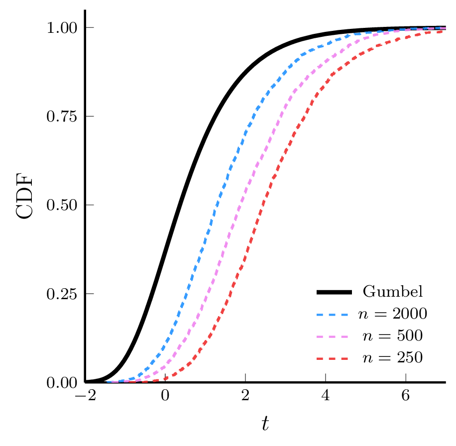{width="90%"}

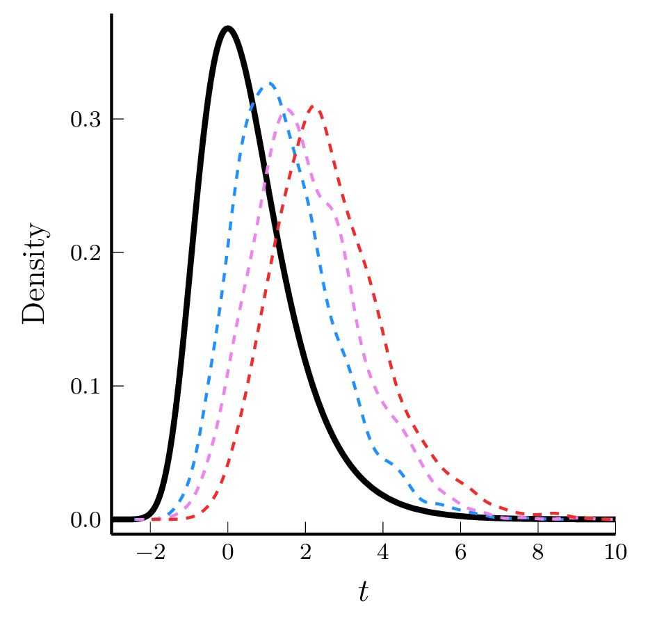{width="90%"}

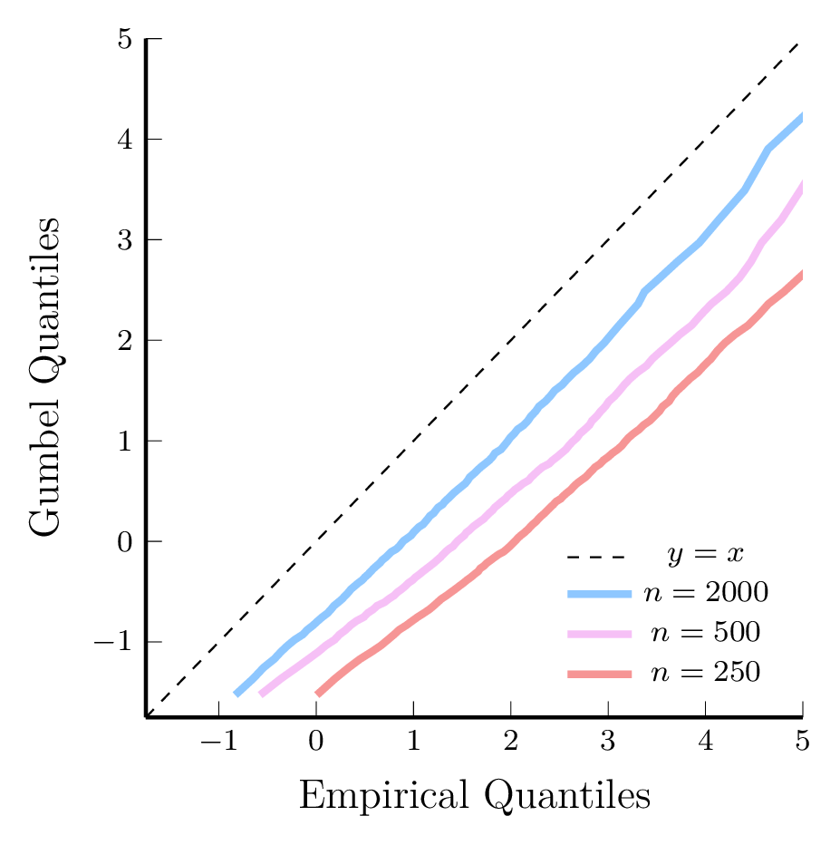{width="90%"}

:::

::: {.fragment .content-box-solid-lightorange .center}
$O\left(\tfrac{\log\log{n}}{\log{n}}\right)$ convergence rate is extremely slow!
:::


## Bootstrap confidence sets

:::: {.columns .v-center-container}

::: {.column width="60%"}
::: {.content-box-purple style="margin-top: -5%" .footnotesize}
**Given:** $D = \DelGreen + \EpsRed$

[**1.** $\hX = \mds(D, p)$]{.fragment .fade-in-then-semi-out fragment-index=1}

[**2.** Compute the residuals $\color{purple}{E} = D - \Del(\hX)$]{.fragment .fade-in-then-semi-out fragment-index=2}

[**3.** For $b = 1, \ldots, B$:]{.fragment .fade-in-then-semi-out fragment-index=3}

[&emsp; **3.1** **Externally randomize** $\color{purple}{E}$ to get $\EpsRed\b$]{.fragment .fade-in-then-semi-out fragment-index=3}

::: {.fragment .fade-in-then-semi-out fragment-index=4}
&emsp; &emsp; &emsp; **• Empirical bootstrap:** &nbsp; $\color{red}{\eps_{ij}} \sim_{\text{iid}} (e_{ij})$ with replacement+br
:::
::: {.fragment .fade-in-then-semi-out fragment-index=5}
&emsp; &emsp; &emsp; **• Multiplier bootstrap:**  $\color{red}{\eps_{ij}} = e_{ij} \cdot r_{ij}$ where $r_{ij} \sim_{\text{iid}} N(0, 1)$
:::

[&emsp; **3.2** Generate noisy dissimilarities $D\b = \Del(\hX) + \EpsRed\b$]{.fragment .fade-in-then-semi-out fragment-index=6}

[&emsp; **3.3** Compute $\hX\b = \mds(D\b, p)$]{.fragment .fade-in-then-semi-out fragment-index=7}

[&emsp; **3.4** Compute $\hat T_n\b = \max_{i}\|\hOm^{-1/2}(\hx_i - \hgc\b(\hx_i\b))\|$ via **Procrustes**]{.fragment .fade-in-then-semi-out fragment-index=7}

[**4.** Compute the **bootstrap quantile** &nbsp;$q_{1-\alpha}\b$&nbsp; of &nbsp; $\{\hat T_n\b(1), \dots, \hat T_n\b(B)\}$]{.fragment fragment-index=8}

**Return:** $\displaystyle\conf_{\alpha, i} := \ellipse\big( \hx_i,\; \hOm_i,\;\; q\b_{1-\alpha} \big)$ for $i=1, \dots, n$

:::
:::


::: {.column width="40%"}

::: {.r-stack .center}

::: {.center .fragment .fade-out fragment-index=1}
{width="100%"}

$D \in \Rnn$
:::

::: {.center .fragment .fade-in-then-out fragment-index=1}
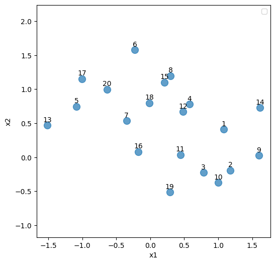{width="100%" scale=1.3 }

+br
$\hX \in \Rnp$
:::

::: {.center  .fragment .fade-in-then-out fragment-index=2}
{width="100%"}

$E \in \Rnn$
:::

::: {.center  .fragment .fade-in-then-out fragment-index=3}
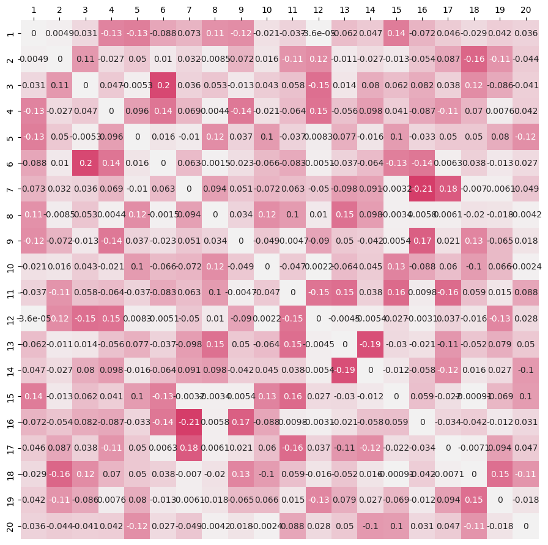{width="100%"}

$\Eps\b \in \Rnn$
:::

::: {.center .fragment .fade-in-then-out fragment-index=6}
{width="100%"}

$D\b \in \Rnn$
:::

::: {.center .fragment fragment-index=7}
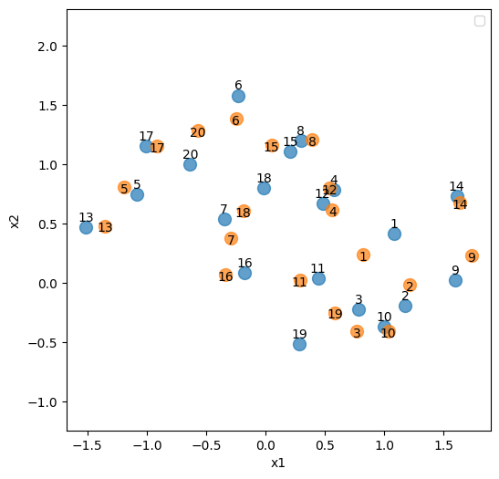{width="100%" scale=1.3 }

+br
$\hX\b \in \Rnp$
:::

:::

:::
::::


## Bootstrap distributional approximation

::: {.center .footnotesize}
${T_n}\quad$ vs. $\quad T_n\b$
:::

::: {.r-hstack}
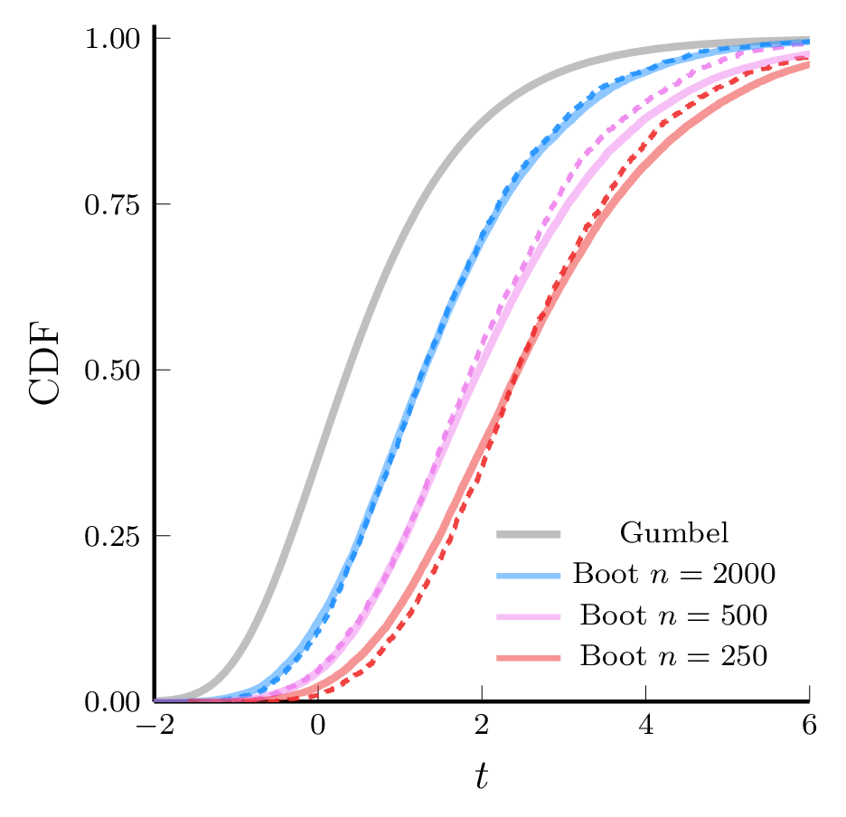{width="100%"}

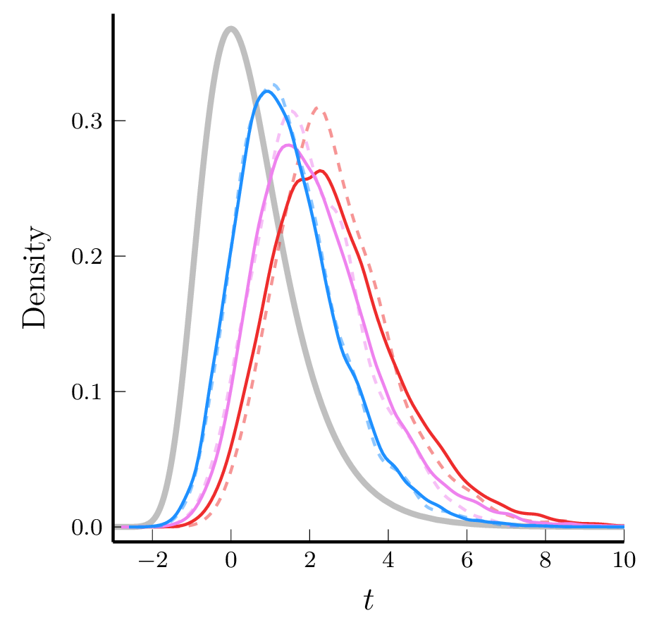{width="100%"}

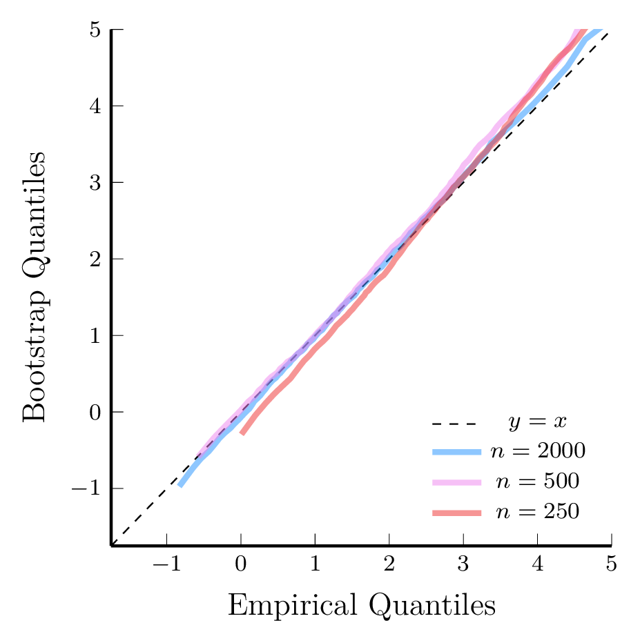{width="100%"}


:::

::: {.content-box-solid-lightorange .center}
The bootstrap distributional approximation is **substantially better!**
:::


## Bootstrap distributional approximation {visibility="uncounted"}

:::{.content-box-orange .small style="margin-top: -1%"}
**Theorem [@vishwanath2025confidence].** [Let $T_n$ and $T_n\b$ be given by:+br+br
&emsp;&emsp;&emsp;&emsp; $\displaystyle T_n =  \sqrt{n}\;\cdot\;\max_{i \in [n]}\norm{\;\;\hOm_i^{-1/2}\big(x_i -  \hgc(\hx_i)\big)\;\;}$ &emsp;&emsp; [and]{.large} &emsp;&emsp; $\displaystyle T_n\b = \sqrt{n}\;\cdot\;\max_{i \in [n]} \norm{\;\;\hOm_i^{-1/2}\big(\hx_i -  \hgc\b(\hx_i\b)\big)\;\;}$]{.small .center .fragment .semi-fade-out fragment-index=1}
+br+br

::: {.fragment fragment-index=1 .fade-in-then-semi-out}
**1. Convergence.** With probability $1-O(n^{-2})$ over the randomness in $\Eps$,

::: {.small}
$$
\sup_{t \in \R}\Bigg|\;\; \pr\big(T_n \le t \big) - \pr\big(T_n\b \le t \big) \;\;\Bigg| \lesssim \color{brown}{\frac{\log^5{n}}{{\sqrt{n}}}}
$$
:::
:::

+br

::: {.fragment fragment-index=2 .fade-in}
**2. Confidence set.** For a confidence level $1-\alpha$, let $q\b_{1-\alpha}$ be the $(1-\alpha)$ **Bootstrap quantile**, and consider the ellipsoids

::: {.footnotesize}
$$
\conf\b_{\alpha, i} := \ellipse\Big( \hx_i,\; \hOm_i,\;\; q\b_{1-\alpha} \Big)
$$
:::


::: {.small .center}
$\displaystyle\pr\Big( \hgc(x_i) \in \conf\b_{\alpha, i} \; \forall i \in [n] \Big) = 1 - \alpha \pm O\Big(\color{brown}{\frac{\log^5{n}}{{\sqrt{n}}}}\Big)$
:::
:::

:::


## Bootstrap Example

::: {.small}
$\X \in \bbX$ is chosen inside an ellipsoid with $\kappa=2$ and $d_{ij} = \color{green}{\del_{ij}} + \color{red}{\eps_{ij}}$ multiplicative/additive noise
:::


:::: {.columns}

::: {.column width="50%" .center}

$\color{red}{\eps_{ij}} \sim N(0, 1)$

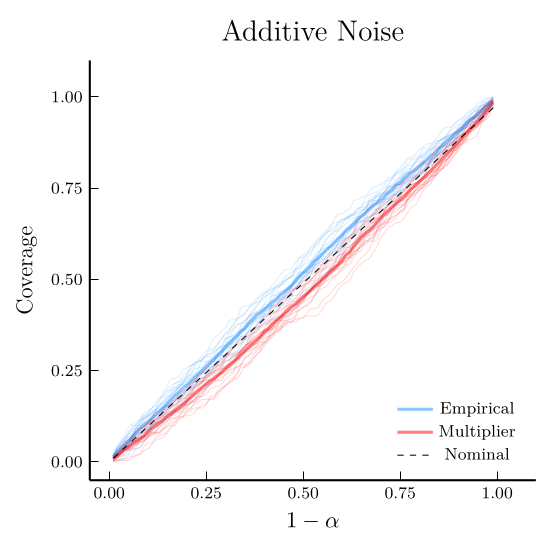{width="75%"}

:::

::: {.column width="50%" .center}

$\color{red}{\eps_{ij}} \sim N(0, \del_{ij}^2)$

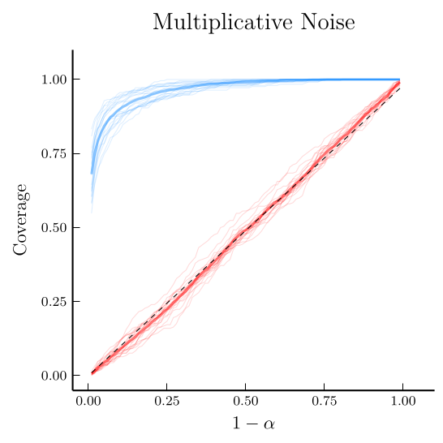{width="75%"}
:::

::::


## Intuition behind extreme value approximation

::::::: {.small}

$$
\boxed{
T_n := \sqrt{n}\; \cdot\; \max_{i \in [n]} \norm{\;\;\color{red}{\hOm_i^{-1/2}\left(x_i -  \hg(\hx_i)\right)}\;\;}
}
$$


::::: {.r-stack}


::: {.r-stack-item .fragment .fade-out fragment-index=1}
For each fixed $i \in [n]$:
$$
\begin{aligned}
\sqrt{n} \cdot \color{red}{\hOm_i^{-1/2}\left(x_i -  \hg(\hx_i)\right)} &= \frac{1}{\sqrt{n}} \sum_{j=1}^n \eps_{ij}x_j \;\; + \underbrace{h_n}_{\text{higher order terms}}\\
\phantom{\sqrt{n} \cdot \color{red}{\hOm_i^{-1/2}\left(x_i -  \hg(\hx_i)\right)}} &\phantom{\;\approx\; \frac{1}{\sqrt{n}} (\eps_{i1}x_1 + \eps_{i2} x_2 + \dots + \eps_{in}x_n) \;\longrightarrow\; N(0, I_p)}
\end{aligned}
$$
:::

::: {.r-stack-item .fragment .fade-in-then-out fragment-index=1}
For each fixed $i \in [n]$ [@li2020central]
$$
\begin{aligned}
\sqrt{n} \cdot \color{red}{\hOm_i^{-1/2}\left(x_i -  \hg(\hx_i)\right)} &\;\approx\; \frac{1}{\sqrt{n}} (\eps_{i1}x_1 + \eps_{i2} x_2 + \dots + \eps_{in}x_n) \;\longrightarrow\; N(0, I_p)\\
\phantom{\sqrt{n}\cdot \norm{\color{red}{\hOm_i^{-1/2}\left(x_i -  \hg(\hx_i)\right)}} }
&\phantom{\;\approx\; \frac{1}{\sqrt{n}} \norm{\eps_{i1}x_1 + \eps_{i2} x_2 + \dots + \eps_{in}x_n}  \;\longrightarrow\; \chi_p}
\end{aligned}
$$

:::


::: {.r-stack-item .fragment .fade-in-then-out fragment-index=2}
For each fixed $i \in [n]$
$$
\begin{aligned}
\sqrt{n} \cdot \color{red}{\hOm_i^{-1/2}\left(x_i -  \hg(\hx_i)\right)} &\;\approx\; \frac{1}{\sqrt{n}} (\eps_{i1}x_1 + \eps_{i2} x_2 + \dots + \eps_{in}x_n) \;\longrightarrow\; N(0, I_p)\\
\sqrt{n}\cdot \norm{\;\color{red}{\hOm_i^{-1/2}\left(x_i -  \hg(\hx_i)\right)}\;} 
&\;\approx\; \frac{1}{\sqrt{n}} \norm{\eps_{i1}x_1 + \eps_{i2} x_2 + \dots + \eps_{in}x_n}  \;\longrightarrow\; \chi_p
\end{aligned}
$$
:::

::: {.r-stack-item .fragment .fade-in-then-out fragment-index=3}
$$
\begin{aligned}
\sqrt{n}\cdot \norm{\;\color{red}{\hOm_1^{-1/2}\left(x_1 -  \hg(\hx_1)\right)}\;} &\;\approx\; \frac{1}{\sqrt{n}} \norm{\eps_{11}x_1 + \eps_{12} x_2 + \dots + \eps_{1n}x_n} \;\longrightarrow\; \chi_p\\
\sqrt{n}\cdot \norm{\;\color{red}{\hOm_2^{-1/2}\left(x_2 -  \hg(\hx_2)\right)}\;} &\;\approx\; \frac{1}{\sqrt{n}} \norm{\eps_{21}x_1 + \eps_{22} x_2 + \dots + \eps_{2n}x_n} \;\longrightarrow\; \chi_p\\[0.5em]
\vdots\quad\quad &\;\approx\; \quad\quad\vdots\\[0.5em]
\sqrt{n}\cdot \norm{\;\color{red}{\hOm_n^{-1/2}\left(x_n -  \hg(\hx_n)\right)}\;} &\;\approx\; \frac{1}{\sqrt{n}} \norm{\eps_{n1}x_1 + \eps_{n2} x_2 + \dots + \eps_{nn}x_n} \;\longrightarrow\; \chi_p
\end{aligned}
$$

::: {.content-box-dblue .center style="width: 100% !important;"}
Maximum of [**independent**]{.uva-orange} $\chi_p$ random variables converges to Gumbel at rate $O\left(\frac{1}{\log{n}}\right)$
:::

:::


::: {.r-stack-item .fragment .fade-in fragment-index=4}
$$
\begin{aligned}
\sqrt{n}\cdot \norm{\;{\hOm_1^{-1/2}\left(x_1 -  \hg(\hx_1)\right)}\;} &\;\approx\; \frac{1}{\sqrt{n}} \norm{0x_1 + \color{lime}{\eps_{12}} x_2 + \dots + \color{brown}{\eps_{1n}}x_n} \;\longrightarrow\; \chi_p\\
\sqrt{n}\cdot \norm{\;{\hOm_2^{-1/2}\left(x_2 -  \hg(\hx_2)\right)}\;} &\;\approx\; \frac{1}{\sqrt{n}} \norm{\color{lime}{\eps_{21}}x_1 + 0 x_2 + \dots + \color{magenta}{\eps_{2n}}x_n} \;\longrightarrow\; \chi_p\\[0.5em]
\vdots\quad\quad &\;\approx\; \quad\quad\vdots\\[0.5em]
\sqrt{n}\cdot \norm{\;{\hOm_n^{-1/2}\left(x_n -  \hg(\hx_n)\right)}\;} &\;\approx\; \frac{1}{\sqrt{n}} \norm{\color{brown}{\eps_{n1}}x_1 + \color{magenta}{\eps_{n2}} x_2 + \dots + 0x_n} \;\longrightarrow\; \chi_p
\end{aligned}
$$

::: {.content-box-dblue style="width: 100% !important;" .center}
The random variables in $T_n$ are [**not independent**]{.uva-orange}! The main proof uses:+br
(i) Chen-Stein Poisson approximation &emsp; (ii) a **local** anti-concentration inequality for Gaussian quadratic forms
:::

:::


:::::
:::::::


## Why the bootstrap approximation is better


:::: {.columns .small}

::: {.column width="50%"}
**Population world**

::: {.footnotesize}
We observe $D = \color{green}{\DelXGreen} + \EpsRed\phantom{{}\b}$ and $\hX = \mds(D, p)\phantom{\hat T_n\b}$
:::
:::

::: {.column width="50%"}
**Bootstrap world**

::: {.footnotesize}
We observe $D\b = \color{green}{\Del(\hX)} + \EpsRed\b$ and $\hX\b = \mds(D\b, p)$
:::
:::


+br+br

::: {.r-stack}
{width="100%" scale=1.6 .fragment .fade-out fragment-index=1}

{width="100%" scale=1.6 .fragment .fade-in-then-out fragment-index=1}

{width="100%" scale=1.6 .fragment .fade-in-then-out fragment-index=2}

{width="100%" scale=1.6 .fragment fragment-index=3}
:::

::::


## Adaptivity of Multiplier Bootstrap to Heteroscedasticity

::: {.small}
$\X \in \bbX$ is uniformly spaced on a grid and $d_{ij} = \color{green}{\del_{ij}} + \color{red}{\eps_{ij}}$ with radial sum/difference noise: 
:::

:::: {.columns .center}

::: {.column width="50%" .center}

$\color{red}{\eps_{ij}} \sim N(0, \|x_i\|^2 + \|x_j\|^2)$

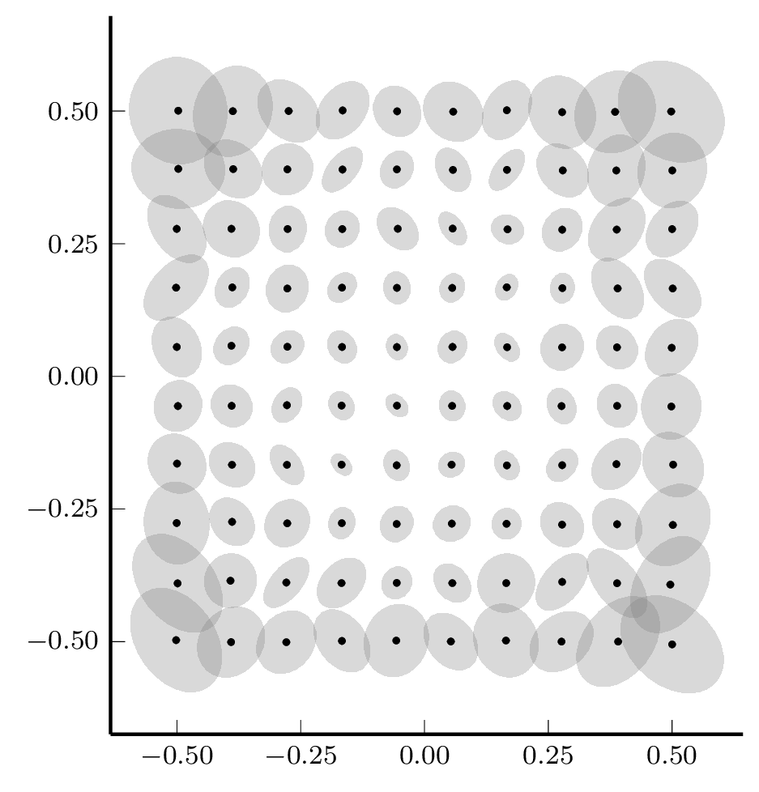{width="77%"}

:::

::: {.column width="50%" .center}

$\color{red}{\eps_{ij}} \sim N(0, |\|x_i\|^2 - \|x_j\|^2|)$

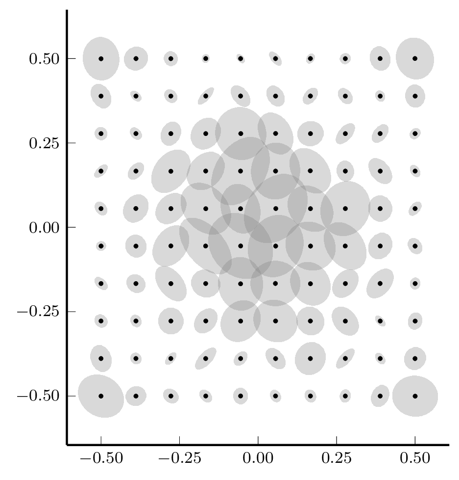{width="77%"}

:::

::::


## Beyond Gaussian Multiplier Bootstrap

::: {.small}
$\XGreen \in \R^{350 \times 2}$ is the location of the $350$ largest US cities and $\log d_{ij} = \color{green}{\log\del_{ij}} + \color{red}{\eps_{ij}}$ where $\color{red}{\eps_{ij}} \sim N(0, \sigma^2 )$

1. **Gaussian multipliers** $r_{ij} \sim N(0, 1)$
2. **Rademacher multipliers** $r_{ij} \sim \text{Rademacher}(\pm 1)$
3. **Uniform multipliers** $r_{ij} \sim \text{Unif}([- \sqrt{3}, \sqrt{3}])$

+br

| Nominal level $\rightarrow$      | [0.999]{.uva-orange} | [0.99]{.uva-orange} | [0.975]{.uva-orange} | [0.95]{.uva-orange} | [0.925]{.uva-orange} | [0.9]{.uva-orange}    | [0.85]{.uva-orange}   | [0.8]{.uva-orange}    | [0.75]{.uva-orange}   |
|-------------|-------|------|-------|------|-------|--------|--------|--------|--------|
| Gaussian    | **0.998** | 0.992  | 0.983  | 0.954  | 0.932  | **0.902** | **0.851** | **0.789** | **0.707** |
| Rademacher  | 0.997     | 0.988  | **0.980** | **0.951**  | **0.924** | 0.895     | 0.825     | 0.738     | 0.628     |
| Uniform     | 0.997     | **0.991** | 0.983 | 0.953 | 0.930 | 0.897     | 0.837     | 0.750     | 0.659     |
| Empirical   | 1.000     | 1.000  | 1.000  | 1.000  | 0.997  | 0.994     | 0.994     | 0.953     | 0.983     |
| Gumbel      | 0.939     | 0.847  | 0.772  | 0.690  | 0.630  | 0.580     | 0.508     | 0.423     | 0.356     |

:::


## Sensor Localization - Example 1


```{python}
fig = go.Figure()
fig.update_layout(
    geo=dict(
        scope="usa",
        projection=go.layout.geo.Projection(type="albers usa"),
        showland=True,
        landcolor=f"rgba({a}, {a}, {a}, 1.0)",
        showsubunits=True,
        subunitcolor="black",   # state border color
        subunitwidth=1
    )
)

fig.add_trace(go.Scattergeo(
    lat=pts[:,0],
    lon=pts[:,1],
    mode="markers",
    marker=dict(
        symbol="circle",
        size=10,
        color="black",
        line=dict(width=1, color="black")
    ),
    hoverinfo="skip"        # disables hover
))

fig.add_trace(go.Scattergeo(
    lon=lons,
    lat=lats,
    text=labels,
    mode="markers+text",
    textposition="top center",
    textfont=dict(
        size=14,
    ),
    marker=dict(
        size=10,
        symbol="x",
        color="red",
        line=dict(width=0.01, color="red")
    ),
    hoverinfo="skip"        # disables hover
))

fig.update_geos(
    lataxis=dict(range=[24, 50]),
    lonaxis=dict(range=[-125, -66])
)
# adjust figure size


fig.show()
```


## Sensor Localization - Example 1 {visibility="uncounted"}


```{python}

ellipses = [
    np.array([[2.468017077579583, -0.39142097029727185], [-0.39142097029727185, 10.289982779036782]]),
    np.array([[2.250906098723061, 0.11238004050197975], [0.11238004050197975, 7.588772628436054]]),
    np.array([[1.1927962770755824, -0.03172295061944705], [-0.03172295061944705, 8.259885002626435]]),
    np.array([[1.8406536008076417, 0.43800337694479713], [0.43800337694479713, 10.452625908907532]]),
    np.array([[1.5944867619391174, 0.33968161933149954], [0.33968161933149954, 4.767834664449261]]),
    np.array([[1.21881992369177, 0.2013772476496925], [0.2013772476496925, 3.2307681191014104]]),
    np.array([[3.891984094523177, 0.07374895930561526], [0.07374895930561526, 9.320467587921016]]),
    np.array([[1.4546459336890705, -0.24982534642073528], [-0.24982534642073528, 3.8920963311497423]]),
    np.array([[3.8432371387420385, -0.1430584400033656], [-0.1430584400033656, 10.309892186856777]]),
    np.array([[1.5088822387315137, -0.5023502631328222], [-0.5023502631328222, 4.748962962327717]]),
    np.array([[4.263602342057142, -1.6999153867114396], [-1.6999153867114396, 9.034773668248434]]),
    np.array([[1.046934186691528, 0.19225180857869922], [0.19225180857869922, 4.843336671539482]]),
    np.array([[0.783520265070989, 0.413563369927824], [0.413563369927824, 3.030009405731471]]),
    np.array([[1.6924083470669555, -0.11296900271252386], [-0.11296900271252386, 6.986292520542568]]),
    np.array([[2.753018506557935, -0.49349319570788175], [-0.49349319570788175, 7.639370563223294]]),
    np.array([[1.279775680238266, 0.3666922113139228], [0.3666922113139228, 4.80871214220213]]),
    np.array([[1.708449169704774, -0.4454344166130284], [-0.4454344166130284, 4.783876481597376]]),
    np.array([[2.1113931780514754, -0.3333267899683792], [-0.3333267899683792, 9.511067085731291]]),
    np.array([[1.0955276360627721, 0.5103416488925722], [0.5103416488925722, 4.544539746936275]]),
    np.array([[1.1431929896672604, 0.6707389617601615], [0.6707389617601615, 5.094603284354269]]),
    np.array([[2.005688002020819, -0.48802726217223813], [-0.48802726217223813, 5.0339543953624]]),
    np.array([[1.939711341768792, -0.5436713780240532], [-0.5436713780240532, 5.788115319419898]]),
    np.array([[3.9778613616532974, 0.21292670375766287], [0.21292670375766287, 10.31393281462724]]),
    np.array([[1.535735186385431, 0.5095400023738197], [0.5095400023738197, 5.414367425750979]]),
    np.array([[1.1119111955083785, -0.5197743259158305], [-0.5197743259158305, 1.9814023823549625]]),
    np.array([[2.5329409225953916, -0.18359025032545156], [-0.18359025032545156, 10.52380605919815]]),
    np.array([[1.2328875577305305, 0.2437246475835416], [0.2437246475835416, 5.745240329350703]]),
    np.array([[2.004979908731868, -0.060380495187101466], [-0.060380495187101466, 7.286021040411914]]),
    np.array([[2.2854068119779853, -0.5217193598799783], [-0.5217193598799783, 5.163064894484483]]),
    np.array([[2.265361526692174, -0.3768095912405867], [-0.3768095912405867, 7.1336234243512635]]),
]
```

```{python}
import numpy as np
import plotly.graph_objects as go

# pts: (N,2) array of [lat, lon]
# ellipses: list of N (2,2) SPD "shape" matrices

def ellipse_latlon_points(center_latlon, S, n=80, level=1.0):
    """
    Unit ellipsoid/ellipse defined by (x-c)^T S (x-c) = level^2.
    Here x is [lat, lon] in degrees. Returns arrays (lats, lons).

    If you intended S to be a covariance matrix instead, use S_inv = np.linalg.inv(S)
    (see note at bottom).
    """
    c = np.asarray(center_latlon, dtype=float)          # [lat, lon]
    S = np.asarray(S, dtype=float)
    S = np.linalg.inv(S)

    # For (x-c)^T S (x-c) = level^2, we can write:
    # x = c + (level) * inv(sqrtm(S)) @ u,  where ||u||=1
    # Compute inv(sqrtm(S)) via eigen-decomposition (S is 2x2 SPD).
    w, V = np.linalg.eigh(S)
    inv_sqrt = V @ np.diag(1.0 / np.sqrt(w)) @ V.T      # 2x2

    t = np.linspace(0, 2*np.pi, n, endpoint=True)
    unit_circle = np.vstack([np.cos(t), np.sin(t)])     # 2 x n

    pts_local = c[:, None] + (level * inv_sqrt @ unit_circle)
    lats = pts_local[0, :]
    lons = pts_local[1, :]
    return lats, lons

fig = go.Figure()

a = 240
fig.update_layout(
    geo=dict(
        scope="usa",
        projection=go.layout.geo.Projection(type="albers usa"),
        showland=True,
        landcolor=f"rgba({a}, {a}, {a}, 0.5)",
        showsubunits=True,
        subunitcolor="black",
        subunitwidth=1
    )
)

# original points
fig.add_trace(go.Scattergeo(
    lat=pts[:, 0],
    lon=pts[:, 1],
    mode="markers",
    marker=dict(symbol="circle", size=10, color="black", line=dict(width=1, color="black")),
    hoverinfo="skip"
))

# ellipses as line loops
for i, (c, S) in enumerate(zip(pts, ellipses)):
    elat, elon = ellipse_latlon_points(c, S, n=120, level=1.0)

    # ensure closed loop (toself usually works either way, but this is explicit)
    elat = np.r_[elat, elat[0]]
    elon = np.r_[elon, elon[0]]

    fig.add_trace(go.Scattergeo(
        lat=elat,
        lon=elon,
        mode="lines",
        line=dict(width=1, color="rgba(0,0,0,0.6)"),
        fill="toself",
        fillcolor="rgba(0,0,0,0.15)",  # shaded interior
        hoverinfo="skip",
        showlegend=False
    ))

# (optional) city markers from your existing code
fig.add_trace(go.Scattergeo(
    lon=lons,
    lat=lats,
    text=labels,
    mode="markers+text",
    textfont=dict(size=14),
    textposition="top center",
    marker=dict(size=10, symbol="x", color="red", line=dict(width=0.01, color="red")),
    hoverinfo="skip"
))

fig.update_geos(
    lataxis=dict(range=[24, 50]),
    lonaxis=dict(range=[-125, -66])
)

fig.show()

# NOTE:
# If your "shape matrix" is actually a covariance matrix Σ and you want the usual covariance ellipse
# (x-c)^T Σ^{-1} (x-c) = level^2, then call:
#   elat, elon = ellipse_latlon_points(c, np.linalg.inv(Sigma), level=1.0)
# or change ellipse_latlon_points to use sqrtm(Σ) instead of inv(sqrtm(S)).

```


<p></p>
::: {.content-box-solid-lightorange .center}
$\pr(\displaystyle\XGreen\in \conf_{\alpha}) \approx 0.9$
:::


## Senate Voting - Example 2


Senators' voting records in the 116th U.S. Congress from 2019--2021 [@lewis2019voteview]
$$
d_{ij} = \% \text{disagreement between senators $i$ and $j$ on roll-call votes}.
$$
$D = (d_{ij}) \in \R^{100 \times 100}$ and let $\hX = \mds(D, 2) \in \R^{100 \times 2}$ be the  embedding


```{python}
fig = px.scatter(
    plot_df,
    x="x", y="y",
    color="party_code",
    color_discrete_map={100: "dodgerblue", 200: "red", 328: "purple"},
    hover_name="bioname",
    hover_data={},  # remove all other hover fields
)

# show ONLY the bioname (and remove the extra trace-name line)
fig.update_traces(hovertemplate="%{hovertext} <extra></extra>")

fig.update_traces(hoverlabel_font_size=20, marker=dict(size=15))
fig.update_layout(template="simple_white", showlegend=False)
fig.update_xaxes(showgrid=False)
fig.update_yaxes(showgrid=False)
fig.update_layout(title_text="US Congress #116 - Senate (2019 - 2021)", title_x=0.5)

# add ellipses for each Sigma in Sigmas at location X
import plotly.graph_objects as go
from plotly.subplots import make_subplots
from numpy import pi, sin, cos
def ellipse(x_center=0, y_center=0, ax1 = [1, 0],  ax2 = [0,1], a=1, b =1,  N=100):
    # x_center, y_center the coordinates of ellipse center
    # ax1 ax2 two orthonormal vectors representing the ellipse axis directions
    # a, b the ellipse parameters
    # if np.linalg.norm(ax1) != 1 or np.linalg.norm(ax2) != 1:
    #     raise ValueError(f'{np.linalg.norm(ax1)}: ax1, ax2 must be unit vectors')
    if  abs(np.dot(ax1, ax2)) > 1e-06:
        raise ValueError('ax1, ax2 must be orthogonal vectors')
    t = np.linspace(0, 2*pi, N)
    #ellipse parameterization with respect to a system of axes of directions a1, a2
    xs = a * cos(t)
    ys = b * sin(t)
    #rotation matrix
    R = np.array([ax1, ax2]).T
    # coordinate of the  ellipse points with respect to the system of axes [1, 0], [0,1] with origin (0,0)
    xp, yp = np.dot(R, [xs, ys])
    x = xp + x_center 
    y = yp + y_center
    return x, y
for i in range(len(Sigmas)):
    Sigma = Sigmas[i]
    x_center = X.iloc[i, 0]
    y_center = X.iloc[i, 1]
    # eigen decomposition of Sigma
    eigvals, eigvecs = np.linalg.eig(Sigma)
    # sort eigenvalues and eigenvectors
    idx = eigvals.argsort()[::-1]
    eigvals = eigvals[idx]
    eigvecs = eigvecs[:, idx]
    # semi-major and semi-minor axes
    a = np.sqrt(eigvals[0]) * 2
    b = np.sqrt(eigvals[1]) * 2
    # angle of rotation
    angle = np.arctan2(eigvecs[1, 0], eigvecs[0, 0])
    # get ellipse points
    x, y = ellipse(x_center=x_center, y_center=y_center, ax1 =[cos(angle), sin(angle)], ax2=[-sin(angle),cos(angle)], a=a/2.2, b =b/1.2)
    # add scatter with cls color and opacity 0.2
    fig.add_scatter(x=x, y=y, mode = 'lines', name=df_codes.iloc[i]['bioname'], line=dict(color=cls[i]), fill='toself', opacity=0.2,hoverinfo='skip')
    # change name font size
fig.show()
```


## Next Steps

::: {}


::: {.fragment .semi-fade-out fragment-index=1}
[**Uncertainty quantification for manifold learning**]{.large}

* CMDS forms the backbone of **Isomap** [@tenenbaum2000global] and **MVUE** [@weinberger2006introduction]
  * Can we extend these results to non-linear embedding techniques and/or manifold learning?
:::


::: {.fragment .fade-in-then-semi-out fragment-index=1}
[**Missing data and robustness**]{.large}

* CMDS is known to be sensitive to **missing data** and/or **outliers**
  * We study the stability of CMDS when missing data forms a **lateration graph** [@arias2025stability] 
  * Can we develop similar statistical foundations for other algorithms using robust statistics?
:::


::: {.fragment .fade-in fragment-index=2}
[**Other noise models**]{.large}

* We consider $D = \DelXGreen + \EpsRed$ for $\XGreen \in \bbX$
  * What if $D = \Del(Y)$ for $Y = XR$ where $R \in \R^{p \times P}$ is a random embedding matrix?
:::


:::


# []{.center style="align-items: center;"} {visibility="uncounted"}

[Thank you.]{.LARGE .uva-orange .bold .text-shadow}


## References {visibility="uncounted"}

:::: {.Large}
::: {#refs}
:::
::::


# Bonus Slides {visibility="uncounted"}

## Appendix {visibility="uncounted"}

* [Why CMDS exactly recovers the latent configuration](#appendix-why-cmds-works)
* [Fuk-Nagaev Matrix Concentration](#appendix-fuk-nagaev)
* [Experiment: 4 moments are necessary](#appendix-fourth-moment-plots)
* [Slightly stronger assumptions for distributional approximation](#appendix-stronger-assumptions)
* [Local covariance matrices for confidence **ellipsoids**](#appendix-covariance)


## Why CMDS works {#appendix-why-cmds-works visibility="uncounted"}

::: {.fragment .semi-fade-out fragment-index=1}

* In the **realizable setting**, there exists a [**latent configuration**]{.green} $\color{green}{x_1, \dots, x_n} \in \Rp$ such that $\color{green}{\del_{ij} = \|x_i - x_j\|^2}$

* Let $\color{green}{\X} \in \Rnp$ be the [**configuration matrix**]{.green}
:::

::: {.fragment .fade-in-then-semi-out fragment-index=1}
$$
\begin{aligned}
\color{green}{\del_{ij}} &= \norm{x_i}^2 + \norm{x_j}^2 - 2 x_i\tr x_j\\
\color{green}{\Del} &= \diag(\XGreen\XGreen\tr)\onev\tr + \onev \diag(\XGreen\XGreen\tr)\tr - 2 \XGreen\XGreen\tr
\end{aligned}
$$
:::


::: {.center .fragment .fade-in-then-semi-out fragment-index=2}
$\color{green}{\Delc} = -\half \color{magenta}{H} \color{green}{\Del} \color{magenta}{H} = (\color{magenta}{H}\XGreen)(\color{magenta}{H}\XGreen)\tr$
:::
[for $\color{magenta}{H} = I - (1/n)\onev \onev\tr$.]{.fragment .fade-in-then-semi-out fragment-index=2} [The rank-$p$ spectral decomposition of $\Delc$ recovers $\color{magenta}{H}\XGreen$ (up to an orthogonal transformation):]{.fragment .fade-in-then-semi-out fragment-index=3}

::: {.fragment .fade-in-then-semi-out fragment-index=3}
$$
\Delc = (\color{magenta}{H}\XGreen)(\color{magenta}{H}\XGreen)\tr = \color{magenta}{Q}(\hU \h\Lambda \hU\tr)\color{magenta}{Q}\tr
$$
:::


::: {.fragment .fade-in-then-semi-out fragment-index=4}
So the CMDS embedding $\hX = (\color{magenta}{H}\XGreen)\color{magenta}{Q}\tr = \color{magenta}{g}(\XGreen)$ recovers $\XGreen$ up to a rigid transformation $\color{magenta}{g} \in \euc$
:::


::: {.footnote .fade-in-then-semi-out .center .fragment fragment-index=5}
::: {.content-box-yellow}
Without loss of generality, we can assume that the configuration $\X$ is centered, i.e., $H\X = \X$.
:::
:::


## Under the hood: Fuk-Nagaev matrix concentration {#appendix-fuk-nagaev visibility="uncounted"}

:::{.content-box-dblue}
**Classical Fuk-Nagaev Inequality.** 

Suppose $Z_1, \dots, Z_n$ are independent with $\E(Z_i) = 0$ and $\norm{Z_i}_{L^q} \le \sigma$ for some $q \ge 2$+br

Let $S_n = \sum_i Z_i$. For all $0 < r < \frac{(q-2)}{2}$, with probability greater than $1 - O({e^{-t}} + {n^{-r}})$,
$$
|S_n| \lesssim {\sqrt{t \sum_i \Var(Z_i)}} + {\sigma n^{(r+1)/q}}
$$
:::

## Under the hood: Fuk-Nagaev matrix concentration {visibility="uncounted"}

:::{.content-box-dblue}
**[@vishwanath2025minimax, Proposition 3]**

Suppose $\Eps = (\eps_{ij})$ is a symmetric random matrix with independent entries and $\norm{\eps_{ij}}_{L^4} \le \sigma$ for $q > 4$+br

Then, for all $0 < r < \frac{(q-4)}{2}$, with probability greater than $1 - O({e^{-t}} + {n^{-r}})$,
$$
\begin{aligned}
\norm{\Eps}_2 \lesssim \underbrace{\max_{i}\sqrt{\sum_{j} \Var(\eps_{ij})} + \sigma n^{(r+2)/q}\sqrt{t + \log{n}}}_{\text{sub-Gaussian + polynomial tail}}
\end{aligned}
$$
:::


## Appendix: Comparison {#appendix-fourth-moment-plots visibility="uncounted"}
+br

| [Metric]{.uva-orange} | [CMDS Upper Bound]{.uva-orange} | [Minimax Lower Bound]{.uva-orange}+br+br |
|:---------------------:|:-------------------------------:|:-------------------------------:|
| [$$\ell_{\text{RMSE}}$$]{.uva-orange} | $\displaystyle\frac{\sigma\kappa}{\sqrt{n}}$ | $\displaystyle\frac{\sigma\kappa}{\sqrt{n}}$ +br+br |
| [$\ell_{\ttinft}$]{.uva-orange} | $\displaystyle\bar{c}(\params)\cdot \sigma\sqrt{\frac{\log{n}}{n}}$| $\displaystyle\underline{c}(\params)\cdot \sigma\sqrt{\frac{\log{n}}{n}}$ |

+br+br

* $q > 4$ moments is [necessary]{.uva-orange} for consistency
* where $\bar{c}(\params) = \kappa^2(\kappa + \Rx)$ and $\underline{c}(\params) = \kappa(1+\kappa\Rx)\inv$


## Appendix: Comparison {visibility="uncounted"}

* $\XGreen \in \Rnp$ are chosen from an ellipsoid with condition number $\kappa^2$
* $D = \DelXGreen + \EpsRed$ under different noise models with $\color{red}{\eps_{ij}} \sim t_q$ entries

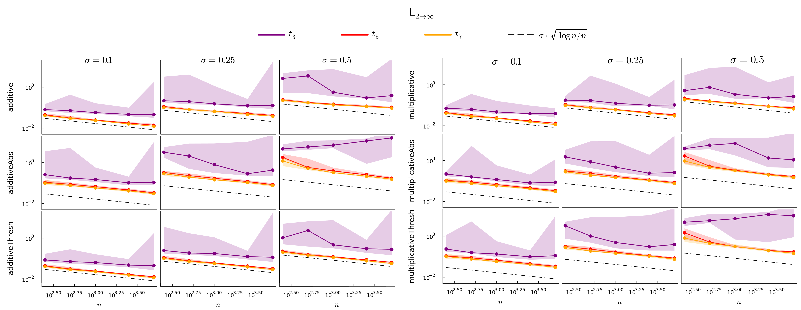{width="100%"}


## Appendix: Comparison {visibility="uncounted"}

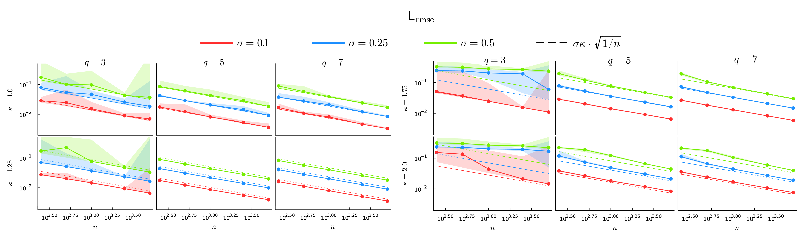{width="100%"}
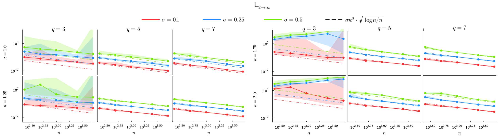{width="100%"}


## Slightly stronger assumptions {#appendix-stronger-assumptions visibility="uncounted"}

::: {.content-box-grey}
$\EpsRed = (\color{red}{\eps_{ij}})$ is a random symmetric hollow matrix with:

1. **Independence:** $\hspace{1em}$ $(\color{red}{\eps_{ij}})$ are independent for $i < j$ with $\E(\color{red}{\eps_{ij}}) = 0$ and $\Var(\color{red}{\eps_{ij}}) = \sigma_{ij}^2$
2. **sub-Exponential tails:** $\hspace{1em}$ $\displaystyle\max_{i < j}\norm{\color{red}{\eps_{ij}}}_{{\psi_1}} \le \Msigma$
3. **Non-degenerate*** $\hspace{1.5em}$ For $\msigma > 0$, $\hspace{1em}$ $\displaystyle\min_{i < j}\sigma_{ij} \ge \msigma$
:::


## Local covariance information {#appendix-covariance visibility="uncounted"}

* $\ttinf{\hX - \hgc(X)}$ leads to [**uniformly spherical**]{.uva-orange} sets

::: {.footnotesize .center}
$\displaystyle\Big\{Y \in \Rnp: \ttinf{\hX - Y} \le r \Big\} = \prod_{i=1}^n B(\hx_i, r)$
:::

::: {.fragment fragment-index=1}
* For $\Eps = (\eps_{ij})$ let $\Sigma_i = \diag( \sigma_{i1}^2, \dots, \sigma_{in}^2 )$. Then,

::: {.footnotesize .center}
$\displaystyle\Omega_i := \frac{n}{4} (\XGreen\tr\XGreen)^{-1}\XGreen\tr \Sigma_i\XGreen(\XGreen\tr\XGreen)^{-1} \in \Rpp$
:::
captures the [**local covariance structure**]{.uva-orange} at each $\hx_i \in \Rp$
:::


::: {.fragment fragment-index=2}
* Let $E = (e_{ij}) = D - \Del(\hX)$ be the matrix of residuals. The [**plug-in estimator*** for $\Omega_i$]{.uva-orange} is

::: {.footnotesize .center}
$\displaystyle\hOm_i := \frac{n}{4} (\hX\tr \hX)^{-1} \hX\tr \h{\Sigma}_i \hX (\hX\tr \hX)^{-1} \in \Rpp$
:::
where $\h{\Sigma}_i = \diag( e_{i1}^2, \dots, e_{in}^2 )$
:::

::: {.footnote .footnotesize .fragment fragment-index=2}
This is the analogue of White's correction for heteroscedasticity [@white1980heteroskedasticity]
:::


## Local covariance information {visibility="uncounted"}

* $\ttinf{\hgc(\hX) - X}$ leads to [**uniformly spherical**]{.uva-orange} sets. 

::: {.footnotesize .center}
$\displaystyle\Big\{X \in \Rnp: \ttinf{\hX - \hgc(X)} \le r \Big\} = \prod_{i=1}^n B(\hx_i, r)$
:::

::: {.fragment fragment-index=1}
* Consider the statistic $\hat{T}_n$ given by

$$
\hat T_n := \max_{i \in [n]} \sqrt{n}\norm{\hOm_i^{-1/2}\left(x_i -  \hgc(\hx_i)\right)}.
$$

:::


::: {.fragment fragment-index=2}
* $\hat T_n$ leads to [**locally ellipsoidal**]{.uva-orange} sets

::: {.footnotesize}
::: {.center}
$\displaystyle\Big\{X \in \Rnp: \hat T_n \le r \Big\} = \prod_{i=1}^n \mathscr{E}\big(\hx_i,\; \hOm_i,\; r\big)$
:::

where $\mathscr{E}(z, \Om, r) := \{ x \in \R^p : (x - z)\tr \Om^{-1} (x - z) \le r^2 \}$
:::
:::

