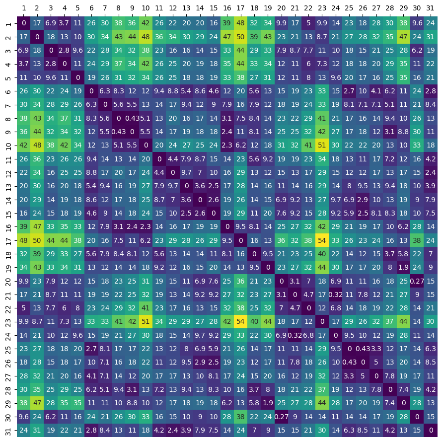
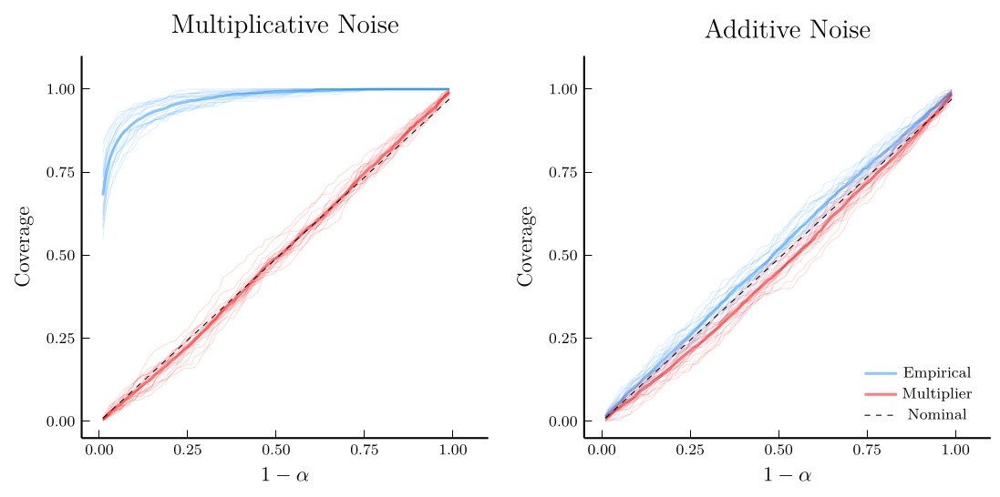
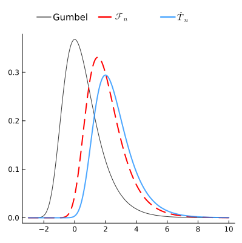
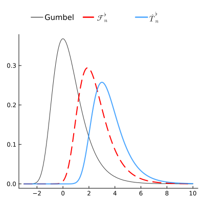

## {.center}

+br+br+br+br

### [A Statistical Framework for+br Multidimensional Scaling From Noisy Data]{.Large}

[Siddharth Vishwanath]{.ucsd-gold .Large}+br

+br

:::: {.columns}

::: {.column width="30%"}
:::

::: {.column width="40%"}
+br+br+br+br
{width=50%}
:::

::: {.column width="30%"}
:::

::::

## {.center}

::: {.center}
<br><br>

{width="500"}

Based on joint work with:+br+br
[Ery Arias-Castro]{.ucsd-gold .large}+br
{width=15%}

:::


# Motivation

$$
\require{enclose}
\require{physics}
\require{ams}
$$


## Pairwise Dissimilarity Data {visibility="uncounted" align="center"}

:::{.center}
Many problems in psychology, sociology, ecology, wireless communication,  neuroscience, bioinformatics, etc.
+br 
involve [**relational**]{.ucsd-gold} data in the form of [**pairwise dissimilarities**]{.ucsd-gold} between items.

{width=35%}

Items: $\{1, 2, \ldots, n\}$
:::


## Pairwise Dissimilarity Data

:::{.center}
Many problems in psychology, sociology, ecology, wireless communication,  neuroscience, bioinformatics, etc.
+br 
involve [**relational**]{.ucsd-gold} data in the form of [**pairwise dissimilarities**]{.ucsd-gold} between items.

{width=35%}
:::

$$
\Del = (\del_{ij})_{1 \leq i,j \leq n} \in \Rnn
$$


## Multidimensional Scaling (MDS)

:::{.content-box-orange}
* Given pairwise dissimilarity data $\Del = (\del_{ij}) \in \Rnn$ and for an **embedding dimension** $p \ll n$ (usually $p=2$ or $p=3$)
* Find a configuration of points $\{ \hx_1, \dots, \hx_n\} \in \Rnp$ such that:
$$
\| \hx_i - \hx_j \| \approx \del_{ij} \quad \text{ for all } 1 \leq i,j \leq n
$$
:::


::: {layout="[30, 1, 30, 1, 30]" layout-valign="center" .fragment}
{width="100%"}

$\longrightarrow$

{width="100%"}

$\longrightarrow$

{width="100%"}
:::


## Multidimensional Scaling (MDS) {visibility="uncounted"}

::::{.columns}

:::{.column width="60%" .center}
{width="40%"}

{width="100%"}
:::

:::{.column width="40%" .center}
{width="100%"}
:::


:::


## Classical MDS (CMDS) Algorithm

:::: {layout="[60, 40]" layout-valign="center"}

:::{.content-box-purple}
**Given:** dissimilarity matrix $\Del = (\del_{ij}) \in \Rnn$ and $p \ll n$

1. +br+br+br
2. +br+br+br
3. +br+br+br

:::


:::{.center}
{width="80%"}

$\Del \in \Rnn$
:::

::::

::: {.footnote .left}
Dates back to [@young1938discussion]. Later rediscovered by [@torgerson1952multidimensional] and [@gower1966some]
:::


## Classical MDS (CMDS) Algorithm {visibility="uncounted"}

:::: {layout="[60, 40]" layout-valign="center"}

:::{.content-box-purple}
**Given:** dissimilarity matrix $\Del = (\del_{ij}) \in \Rnn$ and $p \ll n$

1. **Double centering:** +br $\Delc = -\half H \Del H$ where $H = \Big(I_n - \frac{1}{n}\onev_n \onev_n\tr\Big)$+br
2. +br+br+br
3. +br+br+br

:::


:::{.center}
{width="80%"}

$\Delc \in \Rnn$
:::

::::

::: {.footnote .left}
Dates back to [@young1938discussion]. Later rediscovered by [@torgerson1952multidimensional] and [@gower1966some]
:::


## Classical MDS (CMDS) Algorithm {visibility="uncounted"}

:::: {layout="[60, 40]" layout-valign="center"}

:::{.content-box-purple}
**Given:** dissimilarity matrix $\Del = (\del_{ij}) \in \Rnn$ and $p \ll n$

1. **Double centering:** +br $\Delc = -\half H \Del H$ where $H = \Big(I_n - \frac{1}{n}\onev_n \onev_n\tr\Big)$+br+br
2. **Rank-p spectral decomposition:** $$\Delc = \hU \h\Lambda \hU\tr + \h V_{\perp} \h\Lambda_{\perp} \h V_{\perp}\tr$$
3. +br+br+br

:::


:::{.center .columns}
::: {.column width="25%"}
{width="100%"}

$\hU \in \Rnp$
:::
::: {.column width="75%"}
{width="50%"}

$\hL \in \Rpp$
:::
:::

::::

::: {.footnote .left}
Dates back to [@young1938discussion]. Later rediscovered by [@torgerson1952multidimensional] and [@gower1966some]
:::


## Classical MDS (CMDS) Algorithm {visibility="uncounted"}

:::: {layout="[60, 40]" layout-valign="center"}

:::{.content-box-purple}
**Given:** dissimilarity matrix $\Del = (\del_{ij}) \in \Rnn$ and $p \ll n$

1. **Double centering:** +br $\Delc = -\half H \Del H$ where $H = \Big(I_n - \frac{1}{n}\onev_n \onev_n\tr\Big)$+br+br
2. **Rank-p spectral decomposition:** $$\Delc = \hU \h\Lambda \hU\tr + \h V_{\perp} \h\Lambda_{\perp} \h V_{\perp}\tr$$
3. **Spectral embedding:** $$\hX = \hU \h\Lambda^{1/2}$$
:::


:::{.center .columns}
::: {.column width="25%"}
{width="100%"}

$\hX \in \Rnp$
:::
::: {.column width="75%"}
{width="100%"}

:::
:::

::::

::: {.footnote .left}
Dates back to [@young1938discussion]. Later rediscovered by [@torgerson1952multidimensional] and [@gower1966some]
:::


## Identifiability of MDS Embeddings

* In the [**realizable setting**]{.ucsd-gold}, suppose there exists $x_1, \dots, x_n \in \Rp$ such that $\del_{ij} = \|x_i - x_j\|^2$

* Let $\X$ $\scriptstyle= \begin{bmatrix}
x_1\tr \\\vdots \\x_n\tr\end{bmatrix} \in \Rnp$ be the [**configuration matrix**]{.ucsd-gold}

* For any rigid transformation $g \in \euc$ (i.e., rotation + reflection + translation), [$\Del(X) \equiv \Del(g(X))$]{.ucsd-gold}


:::: {.columns}
::: {.column width="10%"}
:::
::: {.column width="35%"}
{width="80%"}
:::
::: {.column width="25%"}
```{ojs}
// Load libraries
d3 = require("d3@7")
Plot = require("@observablehq/plot@0.6")
Inputs = require("@observablehq/inputs")

// Original coordinates
X = [
  [ 1.14623781,  0.1538715 ],
  [ 1.52213386, -0.08244349],
  [ 1.14854378, -0.50119446],
  [ 0.79205965,  0.49071824],
  [-0.94213814,  0.37757528],
  [-0.13194707,  1.06805394],
  [ 0.03096746,  0.154996  ],
  [ 0.50951258,  0.93249084],
  [ 1.92567077,  0.15466052],
  [ 1.42509235, -0.4438636 ],
  [ 0.59488429, -0.20794035],
  [ 0.72922735,  0.68034407],
  [-1.11931582, -0.04090519],
  [ 1.95532585,  0.65242416],
  [ 0.20594816,  0.84546606],
  [ 0.01612213, -0.24717725],
  [-0.74877507,  0.67520749],
  [ 0.07458595,  0.31634168],
  [ 0.88279825, -0.48225769],
  [-0.45268068,  0.93194446]
]

// Sliders — no labels
viewof theta = Inputs.range([0, 2 * Math.PI], { value: 0, step: 0.01 })
viewof mu    = Inputs.range([-2, 2],         { value: 0, step: 0.1 })

// Transform points
transformed = {
  const cosT = Math.cos(theta);
  const sinT = Math.sin(theta);
  return X.map(([x0, y0]) => {
    const xRot = cosT * x0 - sinT * y0;
    const yRot = sinT * x0 + cosT * y0;
    return { x: xRot + mu, y: yRot + mu };
  });
}

// Reference points as "x", transformed as circles
Plot.plot({
  width: 500,
height: 500,
x: { domain: [-1.5, 2.5] },
y: { domain: [-1, 1.5] },
  marks: [
    Plot.frame(),

    // Larger red "x"
    Plot.text(
      X.map(([x, y]) => ({ x, y, label: "x" })),
      { 
        x: "x",
        y: "y",
        text: "label",
        fill: "red",
        fontSize: 20,     // increase size
        fontWeight: "bold"
      }
    ),

    // Moving configuration
    Plot.dot(transformed, { x: "x", y: "y", r: 4, fill: "blue" })
  ]
})
```
:::
::: {.column width="10%"}
:::
::::


## Why CMDS works

* In the [**realizable setting**]{.ucsd-gold}, suppose there exists $x_1, \dots, x_n \in \Rp$ such that $\del_{ij} = \|x_i - x_j\|^2$

* Let $\X \in \Rnp$ be the [**configuration matrix**]{.ucsd-gold}

::: {.fragment fragment-index=1}
$$
\begin{aligned}
\del_{ij} &= \norm{x_i}^2 + \norm{x_j}^2 - 2 x_i\tr x_j\\
\Del &= \diag(\X\X\tr)\onev\tr + \onev \diag(\X\X\tr)\tr - 2 \X\X\tr
\end{aligned}
$$
:::


::: {.center .fragment fragment-index=2}
$\Delc = -\half H \Del H = (H\X)(H\X)\tr$
:::
[for $H = I - (1/n)\onev \onev\tr$.]{.fragment fragment-index=2} [The rank-$p$ spectral decomposition of $\Delc$ recovers $H\X$ (up to a rigid transformation):]{.fragment fragment-index=3}

::: {.fragment fragment-index=3}
$$
\Delc = (H\X)(H\X)\tr = Q(\hU \h\Lambda \hU\tr)Q\tr
$$
:::


::: {.fragment fragment-index=4}
So the CMDS embedding $\hX = (H\X)Q\tr = g(X)$ recovers $X$ up to a rigid transformation $g \in \euc$
:::


::: {.footnote .center .fragment fragment-index=5}
::: {.content-box-yellow}
Without loss of generality, we can assume that the configuration $\X$ is centered, i.e., $H\X = \X$.
:::
:::


## MDS vs Dimension Reduction

| [Comparison]{.ucsd-gold} | MDS | Dimension Reduction+br+br |
|:----|:--------------------:|:-------------------------:|
| [Data type]{.ucsd-gold} | Pairwise dissimilarities $\Del \in \Rnn$ | Feature vectors $X \in \R^{n \times P}$+br+br+br |
| [Goal]{.ucsd-gold} | Find configuration $\hX \in \Rnp$ such that $\|\hx_i - \hx_j\| \approx \del_{ij}$ | Find low-dimensional representation $\hX \in \R^{n \times p}$ such that $\hx_i\tr\hx_j \approx x_i\tr x_j$ +br+br|
| [Spectral algorithm]{.ucsd-gold} | Classical MDS (CMDS) Algorithm $$\hX = 
\argmin_{Y \in \Rnp} \| \Delc - YY\tr \|_F^2$$ | Principal Component Analysis (PCA) $$\hX = \argmin_{Y \in \R^{n \times p}} \| X X\tr - YY\tr \|_F^2 $$ |
| [Nonlinear methods]{.ucsd-gold} | Isomap, t-SNE, Non-metric MDS, ... | Kernal PCA, LLE, Laplacian Eigenmaps, ... |


# Statistical Framework


## MDS under Noise

:::{.content-box-grey}
In practice, the dissimilarity data is often subject to [**noise**]{.ucsd-gold} and/or [**measurement errors**]{.ucsd-gold}, i.e., we observe:
$$
\begin{aligned}
d_{ij} &= \color{green}{\del_{ij}} + \color{red}{\eps_{ij}}\\
D &= \underbrace{\color{green}{\Del}}_{\color{green}{\text{signal}}} + \underbrace{\color{red}{\Eps}}_{\color{red} {\text{noise}}}
\end{aligned}
$$
:::

::: {layout="[30, 2, 30, 2, 30]" layout-valign="center"}

{width="100%"}

$=$

{width="100%"}

$+$

{width="100%"}

:::


## MDS under Noise {visibility="uncounted"}

:::{.content-box-grey}
In practice, the dissimilarity data is often subject to [**noise**]{.ucsd-gold} and/or [**measurement errors**]{.ucsd-gold}, i.e., we observe:
$$
\begin{aligned}
d_{ij} &= \color{green}{\del_{ij}} + \color{red}{\eps_{ij}}\\
D &= \underbrace{\color{green}{\Del}}_{\color{green}{\text{signal}}} + \underbrace{\color{red}{\Eps}}_{\color{red} {\text{noise}}}
\end{aligned}
$$
:::


:::: {.columns}

:::{.column width="65%"}
+br+br

:::{.content-box-orange}
* $X \in \Rnp$ is the configuration matrix underlying the [signal $\Del$]{.green}
* $\hX = \mds(D, p) \in \Rnp$ is the CMDS embedding of $D$

The [**noisy CMDS embedding** $\hX$]{.ucsd-gold} reflects the variability in $D$ due to $\color{red}{\Eps}$
:::
:::
::: {.column width="35%"}
{width="100%"}
:::

::::


## Desiderata - I (Signal Recovery)

::::{.columns}

:::{.column width="65%"}
:::{}
* Let $X \in \Rnp$ and $D = \DelGreen + \EpsRed$ and 
$\hX = \mds(D, p)$
:::

::: {.fragment fragment-index=1}
* For any metric $\|\hX - X\|_{\dagger}$, define the [**reconstruction error***]{.ucsd-gold}:

:::{.center}
$\displaystyle\ell(\hX, \X) = \min_{g \in \euc} \| g(\hX) - X \|_{\dagger}$
:::
:::

::: {.fragment fragment-index=2}
:::{.content-box-orange}
1. **Can we recover the signal with high probability? i.e.,**
$$
\pr \big( \ell(\hX, X) \lesssim r_n \big) \geq 1 - R_n \quad \text{ for } r_n, R_n \to 0
$$

2. **How does the configuration $X$ affect the reconstruction error?**

3. **How does the noise $\Eps$ impact $\ell(\hX, X)$?**

4. **Can we do better than the CMDS algorithm?**
:::
:::

:::


:::{.column width="35%" .center .fragment fragment-index=1}
```{ojs}
// New Y coordinates
Y = [
[ 0.29082279,  1.2197497  ],
[ 0.54921743,  1.48447509 ],
[ 0.79487358,  0.91690786 ],
[-0.05507621,  0.8399228  ],
[-0.81007186, -0.729762   ],
[-0.96725007,  0.1586658  ],
[ 0.0870127 ,  0.02126686 ],
[-0.75285017,  0.83506472 ],
[ 0.3896396 ,  1.83058711 ],
[ 0.80195523,  1.0558289  ],
[ 0.36033686,  0.47377509 ],
[-0.46475696,  0.76321042 ],
[-0.27488389, -0.99563331 ],
[-0.26321777,  2.15651646 ],
[-0.58762755,  0.50281184 ],
[ 0.10823995, -0.29860396 ],
[-0.93214625, -0.62583634 ],
[-0.30831587,  0.43091851 ],
[ 0.77425273,  0.72337579 ],
[-0.94726912,  0.01034496 ]
]

// Single slider: rotation angle
viewof theta2 = Inputs.range([0, 2 * Math.PI], { value: 0, step: 0.01 })
viewof mu1    = Inputs.range([-2, 2], { value: 0, step: 0.1 })
viewof mu2    = Inputs.range([-2, 2], { value: 0, step: 0.1 })


// Rotate Y (no translation)
rotatedY = {
const cosT = Math.cos(theta2);
const sinT = Math.sin(theta2);
return Y.map(([x0, y0]) => ({
x: cosT * x0 - sinT * y0 + mu1,
y: sinT * x0 + cosT * y0 + mu2
}));
}

// Plot: X as fixed red "x", rotated Y as dots
Plot.plot({
width: 530,
height: 500,
x: { domain: [-1.5, 2.5] },
y: { domain: [-1, 1.5] },
marks: [
Plot.frame(),


// Fixed reference configuration X
Plot.text(
  X.map(([x, y]) => ({ x, y, label: "x" })),
  {
    x: "x",
    y: "y",
    text: "label",
    fill: "red",
    fontSize: 20,
    fontWeight: "bold"
  }
),

// Rotated Y configuration
Plot.dot(rotatedY, { x: "x", y: "y", r: 4, fill: "blue" })
]
})
```
:::

::::

::: {.footnote .small .fragment fragment-index=1}
*modulo rigid transformations
:::


## Desiderata - II (Uncertainty Quantification)


::::{.columns}

:::{.column width="63%" .center}
:::{}
* Let $X \in \Rnp$ and $D = \DelGreen + \EpsRed$ and 
$\hX = \mds(D, p)$
:::

::: {.fragment fragment-index=1}
:::{.content-box-orange}
* For any **confidence level** $\alpha \in (0, 1)$
* Can we construct $100 \times (1-\alpha)\%$ **_uniform_ confidence sets** 
$$
\conf_{\alpha} = \prod_{i=1}^n \conf_{\alpha, i} \subset \Rp
$$
which provide **simultaneous coverage*** of the true configuration:
$$
\boxed{\pr \Big( \exists g \in \euc: \; g(x_i) \in \conf_{\alpha, i} \; \forall i \in [n] \Big) \approx 1 - \alpha}
$$
:::
:::

:::


:::{.column width="37%" .center .fragment fragment-index=1}
{width="100%"}
:::

::::

::: {.footnote .small .fragment fragment-index=1}
*modulo rigid transformations
:::


## Example - 1

Suppose $n=30$ sensors are places in various locations across the United States, and
$$
d_{ij} = \color{red}{\text{noisy}} \text{ squared Euclidean distance between sensors i and j}
$$

::::{.columns}
:::{.column width="50%"}
{width="70%"}
:::
:::{.column width="50%"}
**Are they from the following locations?**

* San Diego, CA
* San Francisco, CA
* Seattle, WA
* Phoenix, AZ
* Las Vegas, NV
* Bozeman, MT
* $\dots$
* Boston, MA
:::

::::

## Example - 1 {visibility="uncounted"}

```{python}
import plotly.graph_objects as go
import numpy as np

# your matrix
pts = np.array([
[  32.83406141, -117.08660315],
[  47.02770987, -122.89411568],
[  31.29852069, -111.65439203],
[  31.62118569, -114.48731997],
[  45.98837659, -111.65341725],
[  37.77745081,  -89.77000914],
[  44.54577855,  -87.90134529],
[  41.85327311,  -81.20545758],
[  41.6005986 ,  -79.81685659],
[  40.55477615,  -73.76294522],
[  27.69516696,  -88.97073603],
[  29.0812641 ,  -95.30569088],
[  33.30148967,  -97.21238827],
[  35.15479604,  -98.11155989],
[  38.6633278 ,  -97.15631268],
[  38.7166127 ,  -77.66344366],
[  45.75725111,  -71.82775132],
[  34.28205952,  -83.58716602],
[  32.6409726 ,  -81.36338606],
[  34.71115964, -105.53182944],
[  38.7642372 , -104.71313524],
[  39.4855405 , -113.13392306],
[  36.84161642, -121.57371125],
[  41.83342175, -105.38791483],
[  42.30109515,  -96.58684866],
[  38.73069401,  -96.64548615],
[  44.25321286,  -94.92624946],
[  36.74867631,  -86.56737061],
[  33.7069636 ,  -80.18294852],
[  31.03255216, -106.70881936],
[  35.88725844,  -91.72196672]
])

lats = pts[:,0]
lons = pts[:,1]

fig = go.Figure()

fig.add_trace(go.Scattergeo(
    lat=lats,
    lon=lons,
    mode="markers",
    marker=dict(
        symbol="circle",
        size=7,
        color="dodgerblue",
        line=dict(width=1, color="dodgerblue")
    ),
    hoverinfo="skip"        # disables hover
))

fig.update_layout(
    geo=dict(
        scope="usa",
        projection=go.layout.geo.Projection(type="albers usa"),
        showland=True,
        landcolor="rgb(240,240,240)"
    ),
    margin=dict(l=0,r=0,t=0,b=0)
)
# update axes limits
fig.update_geos(
    lataxis=dict(range=[24, 50]),
    lonaxis=dict(range=[-125, -66])
)

fig.show()
```
+br

::: {.content-box-white .center}
$\displaystyle\hX = \mds(D, 2) \in \R^{30 \times 2}$
:::


## Example - 1 {visibility="uncounted"}


```{python}
import plotly.graph_objects as go

cities = {
    "San Diego": (32.7157, -117.1611),
    "Seattle": (47.6062, -122.3321),
    "Phoenix": (33.4484, -112.0740),
    "Las Vegas": (36.1699, -115.1398),
    "Bozeman": (45.6760, -111.0429),
    "St Louis": (38.6270, -90.1994),
    "Chicago": (41.8781, -87.6298),
    "Cleveland": (41.4993, -81.6944),
    "Pittsburgh": (40.4406, -79.9959),
    "New York": (40.7128, -74.0060),
    "New Orleans": (29.9511, -90.0715),
    "Houston": (29.7604, -95.3698),
    "Dallas": (32.7767, -96.7970),
    "Oklahoma City": (35.4676, -97.5164),
    "Wichita": (37.6872, -97.3301),
    "Charlottesville": (38.0293, -78.4767),
    "Boston": (42.3601, -71.0589),
    "Atlanta": (33.7490, -84.3880),
    "Orlando": (28.5383, -81.3792),

    # New additions
    "Santa Fe": (35.6870, -105.9378),
    "Denver": (39.7392, -104.9903),
    "Salt Lake City": (40.7608, -111.8910),
    "San Francisco": (37.7749, -122.4194),
    "Cheyenne": (41.1400, -104.8202),
    "Omaha": (41.2565, -95.9345),
    "Minneapolis": (44.9778, -93.2650),
    "Nashville": (36.1627, -86.7816),
    "Charleston": (32.7765, -79.9311),
    "El Paso": (31.7619, -106.4850),
    "Little Rock": (34.7465, -92.2896)
}

lats = [cities[c][0] for c in cities]
lons = [cities[c][1] for c in cities]
labels = list(cities.keys())

fig = go.Figure()

fig.add_trace(go.Scattergeo(
    lat=pts[:,0],
    lon=pts[:,1],
    mode="markers",
    marker=dict(
        symbol="circle",
        size=7,
        color="dodgerblue",
        line=dict(width=1, color="dodgerblue")
    ),
    hoverinfo="skip"        # disables hover
))

fig.add_trace(go.Scattergeo(
    lon=lons,
    lat=lats,
    text=labels,
    mode="markers+text",
    textposition="top center",
    marker=dict(
        size=10,
        symbol="x",
        color="red",
        line=dict(width=0.01, color="red")
    ),
    hoverinfo="skip"        # disables hover
))

fig.update_layout(
    geo=dict(
        scope="usa",
        projection=go.layout.geo.Projection(type="albers usa"),
        showland=True,
        landcolor="rgb(240, 240, 240)"
    )
)

fig.update_geos(
    lataxis=dict(range=[24, 50]),
    lonaxis=dict(range=[-125, -66])
)
fig.show()
```

+br

::: {.content-box-orange .center}
$\displaystyle\hX \stackrel{?}{\cong} X?$
:::


## Example - 2

Using the Senators' voting records in the 116th U.S. Congress from 2019--2021 [@lewis2019voteview]
$$
d_{ij} = \% \text{disagreement between senators i and j on roll-call votes}
$$
$D = (d_{ij}) \in \R^{100 \times 100}$ and let $\hX = \mds(D, 2) \in \R^{100 \times 2}$ be the  embedding


::: {.fragment}
```{python}
import plotly.express as px
import pandas as pd
import numpy as np
# read distance matrix D from data/senate_116_D.csv
# no header
df = pd.read_csv("data/senate_116_D.csv", header=None)
# read df_codes from data/senate_116_df_codes.csv
df_codes = pd.read_csv("data/senate_116_df_codes.csv")
# read X from data/senate_116_X.csv
X = pd.read_csv("data/senate_116_X.csv", header=None)
# read Sigmas from data/senate_116_Sigmas.json each as numpy array
import json
with open("data/senate_116_Sigma.json", "r") as f:
    Sigmas = json.load(f)
    Sigmas = [np.array(Sigma) for Sigma in Sigmas]
# scatterplot of X colored by party from df_codes
# white background + no grid + no colorbar + binary colors for 3 party codes
# red for 200 (Republican), blue for 200 (Republican), purple for 328 (Independent)
# hover info shows "bioname" from df_codes
cls = ['red' if p == 200 else 'dodgerblue' if p == 100 else 'purple' for p in df_codes['party_code']]
fig = px.scatter(
  x=X[0], y=X[1], 
  # color=df_codes['party_code'], 
  color=pd.Categorical(df_codes['party_code']),
  color_discrete_map={100: 'dodgerblue', 200: 'red', 328: 'purple'},
  hover_name=df_codes['bioname']
)
# change hover text font size
fig.update_traces(hoverlabel_font_size=20)
fig.update_layout(template='simple_white', showlegend=False)
fig.update_xaxes(showgrid=False)
fig.update_yaxes(showgrid=False)
fig.update_traces(marker=dict(size=15))
# title
fig.update_layout(title_text="US Congress #116 - Senate (2019 - 2021)", title_x=0.5)
fig.show()
```
:::


# Part I - Signal Recovery

[@vishwanath2025minimax]{.ucsd-gold .Large}


## Statistical Estimation and difficulties

* [**Model:**]{.ucsd-gold}+br+br 
$D = \DelGreen + \EpsRed$ where $\EpsRed = (\color{red}{\eps_{ij}}) \in \Rnn$ is a **symmetric** and **hollow** $n \times n$ random matrix

* [**Parameters:**]{.ucsd-gold}+br+br
$X \in \Rnp$ (configuration matrix underlying $\DelGreen$) [**which consists of $np$ unknown parameters!**]{.ucsd-gold .fragment fragment-index=1}

::: {.center .fragment fragment-index=2}
As $n \uparrow$ then $\#$parameters=$np\!\uparrow$ too!
:::

::: {.fragment fragment-index=3}
* [**Observations**:]{.ucsd-gold}+br+br
We have a total of $N = \binom{n}{2}$ observations $\big\{\del_{ij}: i < j\big\}$
:::


## Assumptions on $X$ and $\Eps$

::: {.content-box-grey}
$X \in \bbX(\params)$ where $\bbX(\params) \subset \Rnp$ is the set of configurations satisfying:

1. **Bounded condition number:** $\hspace{1em}$ $\kappa\inv \le s_p\left(\tfrac{X}{\sqrt{n}}\right) \le s_1\left(\tfrac{X}{\sqrt{n}}\right) \le \kappa$

2. **Compactly supported:** $\hspace{4.5em}$ $\ttinf{X} \le \Rx$
:::

+br

::: {.content-box-grey .fragment}
$\EpsRed = (\color{red}{\eps_{ij}})$ is a random symmetric hollow matrix with:

1. **Independence:** $\hspace{1em}$ $(\eps_{ij})$ are independent for $i < j$ with $\E(\eps_{ij}) = 0$ and $\Var(\eps_{ij}) = \sigma_{ij}^2$
2. **Finite $q$th moment:** $\hspace{1em}$ For $q \ge 4$, $\hspace{1em}$ $\displaystyle\max_{i < j}\norm{\eps_{ij}}_{L^q} \le \sigma$
:::


## Assumptions on $X$ and $\Eps$ {visibility="uncounted"}

For a random matrix $\color{purple}{\Xi = (\xi_{ij})}$ with iid entries, this includes the following types of noise:
$$
\begin{aligned}
d_{ij} &= \del_{ij} + \color{red}{\xi_{ij}} &&\hspace{3em} (\text{additive})\\
d_{ij} &= \del_{ij} + \color{red}{\del_{ij}\xi_{ij}} &&\hspace{3em} (\text{multiplicative})\\
\log d_{ij} &= \log \del_{ij} + \color{red}{\xi_{ij}} &&\hspace{3em} (\text{log-Normal})\\
d_{ij} &= \del_{ij} + \color{red}{2\del_{ij}\xi_{ij} + \xi_{ij}^2} &&\hspace{3em} (\text{absolute additive})\\
\end{aligned}
$$


::: {.content-box-grey}
$\EpsRed = (\color{red}{\eps_{ij}})$ is a random symmetric hollow matrix with:

1. **Independence:** $\hspace{1em}$ $(\eps_{ij})$ are independent for $i < j$ with $\E(\eps_{ij}) = 0$ and $\Var(\eps_{ij}) = \sigma_{ij}^2$
2. **Finite $q$th moment:** $\hspace{1em}$ For $q \ge 4$, $\hspace{1em}$ $\displaystyle\max_{i < j}\norm{\eps_{ij}}_{L^q} \le \sigma$
:::


## Reconstruction error metrics

:::{.content-box-grey}
The [**reconstruction error**]{.ucsd-gold} between the CMDS embedding $\hX$ and the true configuration $X$ is:
$$
\ell(\hX, X) = \min_{g \in \euc} \| g(\hX) - X \|_{\dagger}
$$
:::


* **RMSE:**+br $\hspace{10em}$ $\displaystyle\frac{1}{\sqrt{n}}\norm{g(\hX) - X}_F = \sqrt{\frac{1}{n}\sum_{i=1}^n \norm{g(\hx_i) - x_i}_2^2}$

* **$\ell_2$-operator norm:**+br $\hspace{10em}$ $\displaystyle\norm{g(\hX) - X}_2 = \max_{v \in \mathbb{S}^{p-1}} \norm{(g(\hX) - X)v}_2$

* **$\ell_{\ttinft}$-operator norm:**+br $\hspace{10em}$ $\displaystyle\norm{g(\hX) - X}_{\ttinft} = \max_{i \in [n]} \norm{g(\hx_i) - x_i}$


## Signal recovery

:::{.content-box-orange}
**[@vishwanath2025minimax, Theorem 2, Corollary 2 & Theorem 3]** 

Let $X \in \bbX(\params)$ and $D = \DelGreen + \EpsRed$ and $\hX = \mds(D, p)$

For $0 < r < \frac{q-4}{2}$ and with probability greater than $1 - O(n^{-2} + n^{-r})$:

$$
\begin{aligned}
\ell_{\text{RMSE}}(\hX, X) &\lesssim \frac{\sigma\kappa}{\sqrt{n}}\\[0.5em]
\ell_{\text{op}}(\hX, X) &\lesssim {\sigma\kappa}\\[0.5em]
\ell_{\ttinft}(\hX, X) &\lesssim \bar{c}(\params)\cdot \sigma\sqrt{\frac{\log{n}}{n}}
\end{aligned}
$$
where $\bar{c}(\params) = \kappa^2(\kappa + \Rx)$
:::

::: {.fragment}
* $q \ge 4$ moments on $\eps_{ij}$ are [necessary]{.ucsd-gold} for consistency [see, also, @tao2010random]
* Parametric rates (in $n$) for $\ell_{\text{RMSE}}$ and extra $\sqrt{\log{n}}$ factor for $\ell_{\ttinft}$
:::


## Can we do better than CMDS?

:::{.content-box-dblue}
**Minimax lower bound**

* For $\color{green}{X} \in \bbX(\params)$ and $D = \DelGreen + \EpsRed$ where $\EpsRed \in \mathscr{E}$ is from [**any noise model**]{.ucsd-gold} under the assumptions

* Let $\hX \in \Rnp$ be [**any estimator**]{.ucsd-gold} of $X$ based on $D$

::: {.fragment}
* $r_n$ is a [**minimax lower bound**]{.ucsd-gold} for the reconstruction error $\ell(\hX, X)$ if:

$$
\inf_{\hX} \sup_{\substack{\color{green}{X} \in \bbX(\params),\; \EpsRed \in \mathscr{E}\\ D = \color{green}{\Del(X)} + \EpsRed }} \pr\Big( \ell(\hX, X) \gtrsim r_n \Big) \ge \frac{1}{2}
$$
:::
:::


## Can we do better than CMDS? {visibility="uncounted"}


:::{.content-box-orange}
**[@vishwanath2025minimax, Theorem 4 & Theorem 5]**

* For $\color{green}{X} \in \bbX(\params)$ and $D = \DelGreen + \EpsRed$ where $\EpsRed \in \mathscr{E}$ is from [**any noise model**]{} under the assumptions

* Let $\hX \in \Rnp$ be [**any estimator**]{} of $X$ based on $D$. Then:

$$
\begin{aligned}
\inf_{\hX} \sup_{D = \color{green}{\Del(X)} + \EpsRed } &\pr\Bigg( \ell_{\text{RMSE}}(\hX, X) \gtrsim \frac{\sigma\kappa}{\sqrt{n}} \Bigg) \ge \frac{1}{2}
\end{aligned}
$$
and
$$
\begin{aligned}
\inf_{\hX} \sup_{D = \color{green}{\Del(X)} + \EpsRed } &\pr\Bigg( \ell_{\ttinft}(\hX, X) \gtrsim \underline{c}(\params)\cdot \sigma\sqrt{\frac{\log{n}}{n}} \Bigg) \ge \frac{1}{2}
\end{aligned}
$$
where $\underline{c}(\params) = \kappa(1+\kappa\Rx)\inv$
:::


## Comparison
+br

| [Metric]{.ucsd-gold} | [CMDS Upper Bound]{.ucsd-gold} | [Minimax Lower Bound]{.ucsd-gold}+br+br |
|:---------------------:|:-------------------------------:|:-------------------------------:|
| [$$\ell_{\text{RMSE}}$$]{.ucsd-gold} | $\displaystyle\frac{\sigma\kappa}{\sqrt{n}}$ | $\displaystyle\frac{\sigma\kappa}{\sqrt{n}}$ +br+br |
| [$\ell_{\ttinft}$]{.ucsd-gold} | $\displaystyle\bar{c}(\params)\cdot \sigma\sqrt{\frac{\log{n}}{n}}$| $\displaystyle\underline{c}(\params)\cdot \sigma\sqrt{\frac{\log{n}}{n}}$ |

+br+br

* $q \ge 4$ moments is [necessary]{.ucsd-gold} for consistency
* where $\bar{c}(\params) = \kappa^2(\kappa + \Rx)$ and $\underline{c}(\params) = \kappa(1+\kappa\Rx)\inv$


## Comparison

* $X \in \Rnp$ are chosen from an ellipsoid with condition number $\kappa^2$
* $D = \Del(X) + \EpsRed$ under different noise models with $\color{red}{\eps_{ij}} \sim t_q$ entries

{width="100%"}


## Comparison

{width="100%"}
{width="100%"}


## Under the hood: Procrustes alignment

For each reconstruction error $\ell_{\text{RMSE}}, \ell_2$ and $\ell_{\ttinft}$, we have a different choice of the optimal $g \in \euc$

::: {.footnotesize}

| [$\ell(\hX, X)$]{.ucsd-gold} | [$\displaystyle\widehat{g} = \argmin_{g \in \euc} \| g(\hX) - X \|_{\dagger}$]{.ucsd-gold} |
|:---------------------:|:-------------------------------:|
| $\ell_{\text{RMSE}}$ | $\displaystyle\widehat{g} = \argmin_{g \in \euc{p}}\|g(\hX) - X\|_F$ |
| $\ell_2$ | $\displaystyle\widehat{g} = \argmin_{g \in \euc{p}}\|g(\hX) - X\|_2$ |
| $\ell_{\ttinft}$ | $\displaystyle\widehat{g} = \argmin_{g \in \euc{p}}\|g(\hX) - X\|_{\ttinft}$ |
:::

::: {.fragment .content-box-dblue}
**Orthogonal Procrustes Problem.** For $X, Y \in \Rnp$ the solution to $\hat{g} = \argmin_{g \in \euc}\|g(Y) - X\|_F$ is:
$$
\hg(v) = Ov + \mu
$$
where $\mu = (\bar{x} - O\bar{y})$ and $O \in \mathcal{O}(p)$ is given by $O = W_1W_2\tr$ where
$$
W_1 S W_2\tr = \text{svd}(Y\tr X)
$$
:::


## Under the hood: Procrustes alignment {visibility="uncounted"}

All the upper bounds are proved using $\widehat{g}$ obtained from the [orthogonal Procrustes solution]{.ucsd-gold}, e.g.,
$$
\begin{aligned}
\ell_{\ttinft}(\hX, X) &= \min_{g \in \euc}\|g(\hX) - X\|_{\ttinft}  \\
&\color{red}{\le}\| \widehat{g}(\hX) - X \|_{\ttinft} \;\lesssim\; \bar{c}(\params)\cdot \sigma\sqrt{\frac{\log{n}}{n}}
\end{aligned}
$$

+br


::: {.content-box-dblue}
**Orthogonal Procrustes Problem.** For $X, Y \in \Rnp$ the solution to $\hat{g} = \argmin_{g \in \euc}\|g(Y) - X\|_F$ is:
$$
\hg(v) = Ov + \mu
$$
where $\mu = (\bar{x} - O\bar{y})$ and $O \in \mathcal{O}(p)$ is given by $O = W_1W_2\tr$ where
$$
W_1 S W_2\tr = \text{svd}(Y\tr X)
$$
:::


## Under the hood: Fuk-Nagaev matrix concentration

:::{.content-box-dblue}
**Classical Fuk-Nagaev Inequality.** 

Suppose $Z_1, \dots, Z_n$ are independent with $\E(Z_i) = 0$ and $\norm{Z_i}_{L^q} \le \sigma$ for some $q \ge 2$+br

Let $S_n = \sum_i Z_i$. For all $0 < r < \frac{(q-2)}{2}$, with probability greater than $1 - O({e^{-t}} + {n^{-r}})$,
$$
|S_n| \lesssim {\sqrt{t \sum_i \Var(Z_i)}} + {\sigma n^{(r+1)/q}}
$$
:::

## Under the hood: Fuk-Nagaev matrix concentration {visibility="uncounted"}

:::{.content-box-dblue}
**[@vishwanath2025minimax, Proposition 3]**

Suppose $\Eps = (\eps_{ij})$ is a symmetric random matrix with independent entries and $\norm{\eps_{ij}}_{L^4} \le \sigma$ for $q \ge 4$+br

Then, for all $0 < r < \frac{(q-4)}{2}$, with probability greater than $1 - O({e^{-t}} + {n^{-r}})$,
$$
\begin{aligned}
\norm{\Eps}_2 \lesssim \underbrace{\max_{i}\sqrt{\sum_{j} \Var(\eps_{ij})} + \sigma n^{(r+2)/q}\sqrt{t + \log{n}}}_{\text{sub-Gaussian + polynomial tail}}
\end{aligned}
$$
:::


# Part II - Uncertainty Quantification

[@vishwanath2025confidence]{.ucsd-gold .Large}


## Uncertainty Quantification: What are we after?


::::{.columns}

:::{.column width="63%" .center .small}
:::{}
* Let $X \in \Rnp$ and $D = \DelGreen + \EpsRed$ and 
$\hX = \mds(D, p)$
:::

::: {.fragment fragment-index=1}
:::{.content-box-orange}
* For any **confidence level** $\alpha \in (0, 1)$
* Can we construct $100 \times (1-\alpha)\%$ **_uniform_ confidence sets** 
$$
\conf_{\alpha} = \prod_{i=1}^n \conf_{\alpha, i} \subset \Rp
$$
which provide **simultaneous coverage*** of the true configuration:
$$
\boxed{\pr \Big( \exists g \in \euc: \; g(x_i) \in \conf_{\alpha, i} \; \forall i \in [n] \Big) \approx 1 - \alpha}
$$
:::
:::

:::


:::{.column width="37%" .center .fragment fragment-index=1}
{width="100%"}
:::

::::

::: {.footnote .small .fragment fragment-index=1}
*modulo rigid transformations
:::


## Tail bounds don't suffice

::: {.footnotesize .content-box-gray}
[**Tail bound.** ]{.ucsd-gold} Let $X \in \bbX$ and $D = \Del + \Eps$, and let $\hX = \mds(D, p)$. For a constant $C_1 > 0$,

$$
\begin{aligned}
&\pr\bigg( \ttinf{\hX - \hg(X)} \ge \color{red}{C_1} \underline{c}(\params) \sigma \sqrt{\tfrac{t + \log{n}}{n}} \bigg) \le e^{-t}\\
\implies 
&\pr\bigg( \ttinf{\hX - \hg(X)} \le \color{red}{C_1} \underline{c}(\params) \sigma \sqrt{\tfrac{\log(1/\alpha) + \log{n}}{n}} \bigg) \ge 1-\alpha
\end{aligned}
$$

The constant $\color{red}{C_1}$ is unknown and is likely to be **too conservative**
:::

+br

::: {.footnotesize .content-box-dblue .fragment}
[**Distributional approximation.**]{.ucsd-gold}  Let $\hat{{F}}$ be an estimate for the distribution of $\ttinf{\hX - \hg(X)}$. For a constant $\color{red}{C_2} > 0$,

$$
\begin{aligned}
&|{\pr\big( \ttinf{\hX - \hg(X)} \le t \big) - \pr(\hat{{F}} \le t)}| \le \color{red}{C_2} \rate_n\\
\implies 
&\pr\bigg( \ttinf{\hX - \hg(X)} \le q_{1-\alpha}(\hat{{F}}) \bigg) \ge 1-\alpha - \color{red}{C_2} \rate_n
\end{aligned}
$$
where $\rate_n \to 0$. The constant $\color{red}{C_2}$ **does not** impact the practical use of $\hat{{F}}$
:::


## Local covariance information

* $\ttinf{\hX - \hg(X)}$ leads to [**uniformly spherical**]{.ucsd-gold} sets

::: {.footnotesize .center}
$\displaystyle\Big\{Y \in \Rnp: \ttinf{\hX - Y} \le r \Big\} = \prod_{i=1}^n B(\hx_i, r)$
:::

::: {.fragment fragment-index=1}
* For $\Eps = (\eps_{ij})$ let $\Sigma_i = \diag( \sigma_{i1}^2, \dots, \sigma_{in}^2 )$. Then,

::: {.footnotesize .center}
$\displaystyle\Omega_i := \frac{n}{4} (X\tr X)^{-1} X\tr \Sigma_i X (X\tr X)^{-1} \in \Rpp$
:::
captures the [**local covariance structure**]{.ucsd-gold} at each $\hx_i \in \Rp$
:::


::: {.fragment fragment-index=2}
* Let $E = (e_{ij}) = D - \Del(\hX)$ be the matrix of residuals. The [**plug-in estimator*** for $\Omega_i$]{.ucsd-gold} is

::: {.footnotesize .center}
$\displaystyle\hOm_i := \frac{n}{4} (\hX\tr \hX)^{-1} \hX\tr \h{\Sigma}_i \hX (\hX\tr \hX)^{-1} \in \Rpp$
:::
where $\h{\Sigma}_i = \diag( e_{i1}^2, \dots, e_{in}^2 )$
:::

::: {.footnote .footnotesize .fragment fragment-index=2}
This is the analogue of White's correction for heteroscedasticity [@white1980heteroskedasticity]
:::


## Local covariance information

* $\ttinf{\hg(\hX) - X}$ leads to [**uniformly spherical**]{.ucsd-gold} sets. 

::: {.footnotesize .center}
$\displaystyle\Big\{X \in \Rnp: \ttinf{\hX - \hg(X)} \le r \Big\} = \prod_{i=1}^n B(\hx_i, r)$
:::

::: {.fragment fragment-index=1}
* Consider the statistic $\hat{T}_n$ given by

$$
\hat T_n := \max_{i \in [n]} \sqrt{n}\norm{\hOm_i^{-1/2}\left(x_i -  \hg(\hx_i)\right)}.
$$

:::


::: {.fragment fragment-index=2}
* $\hat T_n$ leads to [**locally ellipsoidal**]{.ucsd-gold} sets

::: {.footnotesize}
::: {.center}
$\displaystyle\Big\{X \in \Rnp: \hat T_n \le r \Big\} = \prod_{i=1}^n \mathscr{E}\big(\hx_i,\; \hOm_i,\; r\big)$
:::

where $\mathscr{E}(z, \Om, r) := \{ x \in \R^p : (x - z)\tr \Om^{-1} (x - z) \le r^2 \}$
:::
:::


## Slightly stronger assumptions

::: {.content-box-grey}
$\EpsRed = (\color{red}{\eps_{ij}})$ is a random symmetric hollow matrix with:

1. **Independence:** $\hspace{1em}$ $(\eps_{ij})$ are independent for $i < j$ with $\E(\eps_{ij}) = 0$ and $\Var(\eps_{ij}) = \sigma_{ij}^2$
2. **sub-Exponential tails:** $\hspace{1em}$ $\displaystyle\max_{i < j}\norm{\eps_{ij}}_{{\psi_1}} \le \Msigma$
3. **Non-degenerate*** $\hspace{1.5em}$ For $\msigma > 0$, $\hspace{1em}$ $\displaystyle\min_{i < j}\sigma_{ij} \ge \msigma$
:::


## Extreme value distributional approximation

:::{.content-box-orange}
**[@vishwanath2025confidence, Theorem 2]**

Let $D = \DelGreen + \EpsRed$ and $\hX = \mds(D, p)$ and let $G$ be a standard **Gumbel** random variable

::: {.fragment fragment-index=1}
**1. Convergence.** There exists deterministic sequences* $(a_n)$ and $(b_n)$ such that for all $t \in \R$,

::: {.small}
$$
\Bigg| \pr\Big( \tfrac{\hat T_n - b_n}{a_n} \le t \Big) - \pr\big( G \le t \big) \Bigg| \lesssim \frac{\log\log{n}}{\log{n}}
$$
:::
:::

::: {.fragment fragment-index=2}
**2. Confidence Set.** For a confidence level $1-\alpha$, let $q_{1-\alpha}$ be the $(1-\alpha)$ Gumbel quantile, and

::: {.footnotesize}
$$
\conf_{\alpha, i} := \ellipse\Big( \hx_i,\; \hOm_i,\;\; b_n + a_n q_{1-\alpha} \Big)
$$
:::


::: {.small .center}
$\displaystyle\pr\Big( \hg(x_i) \in \conf_{\alpha, i} \; \forall i \in [n] \Big) = 1 - \alpha \pm O\Big(\frac{\log\log{n}}{\log{n}}\Big)$
:::
:::

:::


::: {.footnote .footnotesize .fragment fragment-index=1}
$b_n^2 = {2\log{n} + (p-2)\log\log{n} - 2\log{\Gamma(p/2)}}$ and $a_n = 1/b_n$
:::


## Extreme value distributional approximation {visibility="uncounted"}


:::: {.columns}

::: {.column width="60%"}
::: {.footnotesize}
* Given $D = \DelGreen + \EpsRed$ and $\hX = \mds(D, p)$, let

$$\conf_{\alpha, i} := \ellipse\Big( \hx_i,\; \hOm_i,\;\; b_n + a_n q_{1-\alpha} \Big)$$ 
Then,
$$
\pr\Big( \hg(x_i) \in \conf_{\alpha, i} \; \forall i \in [n] \Big) = 1 - \alpha \pm O\Big(\frac{\log\log{n}}{\log{n}}\Big)
$$

* **Advantages:**
  1. **Bona fide** confidence set and adaptive to local covariance structure
  2. Low computational overhead - only requires computing CMDS and $\hOm_i$

* **Disadvantages:**
  1. $O(\log\log{n}/\log{n})$ convergence rate is extremely slow
  2. Approximation typically leads to anti-conservative confidence sets
:::
:::

::: {.column width="40%" .center}
::: {.r-stack}
{width="100%"}

{width="100%" .fragment fragment-index=1}

{width="100%" .fragment fragment-index=2}

:::
Distribution of $\frac{\hat T_n - b_n}{a_n}$ vs. $G$
:::


::::


## Intuition behind extreme value approximation


## Bootstrap confidence sets

:::: {.columns}

::: {.column width="60%"}
::: {.content-box-purple .footnotesize}
**Given:** $D = \DelGreen + \EpsRed$
+br+br

[1. $\hX = \mds(D, p)$]{.fragment fragment-index=1}

[2. Compute the residuals $\color{purple}{E} = D - \Del(\hX)$]{.fragment fragment-index=2}

[3. For $b = 1, \ldots, B$:]{.fragment fragment-index=3}

[&emsp; 3.1. **Externally randomize** $\color{purple}{E}$ to get $\EpsRed\b$]{.fragment fragment-index=3}

[&emsp; 3.2. Generate noisy dissimilarities $D\b = \Del(\hX) + \EpsRed\b$]{.fragment fragment-index=4}

[&emsp; 3.3. Compute $\hX\b = \mds(D\b, p)$]{.fragment fragment-index=5}

[&emsp; 3.4. Compute $\hat T_n\b = \max_{i}\|\hOm^{-1/2}(\hx_i - g\b(\hx_i\b))\|$ via Procrustes]{.fragment fragment-index=5}

[4. Compute the **bootstrap quantile** $q_{1-\alpha}\b$ of $\hat T_n\b(1), \dots, \hat T_n\b(B)$]{.fragment fragment-index=6}

+br

**Return:** $\displaystyle\conf_{\alpha, i} := \ellipse\big( \hx_i,\; \hOm_i,\;\; q\b_{1-\alpha} \big)$ for $i=1, \dots, n$

:::
:::


::: {.column width="40%"}

::: {.r-stack .center}

{width="80%"}

{width="100%" .fragment fragment-index=1}

{width="85%" .fragment fragment-index=2}

{width="85%" .fragment fragment-index=3}

{width="85%" .fragment fragment-index=4}

{width="100%" .fragment fragment-index=5}

:::

:::
::::


## External randomization of residuals

:::: {.columns .small}

::: {}
[**Multiplier bootstrap**]{.ucsd-gold}

* Generate $R = (r_{ij})$ iid from $N(0, 1)$

* Set $\EpsRed\b = E \circ R$

* Features:
  - Slower to compute
  - Works for **heteroscedastic** errors 
:::

::: {}
[**Empirical bootstrap**]{.ucsd-gold}

* Sample $r$ with replacement from $\text{vec}(\text{upper-triangular}(E))$

* Set $\EpsRed\b = \text{Sym}(r)$

* Features:
  - Faster to compute
  - **Only works** when $\Eps = (\eps_{ij})$ are **iid**

:::


::::

::: {.footnote .footnotesize}

:::


## Bootstrap consistency

:::{.content-box-orange .small}
**[@vishwanath2025confidence, Theorem 2]**

Let $D = \DelGreen + \EpsRed$ and let $\hX = \mds(D, p)$ and $\hX\b = \mds(D\b, p)$ Define:

::: {.footnotesize .center}
$\displaystyle\hat T_n = \max_{i \in [n]} \max_{i \in [n]} \sqrt{n}\norm{\hOm_i^{-1/2}\big(x_i -  \hg(\hx_i)\big)}$ &nbsp;&nbsp; [and]{.large} &nbsp;&nbsp; $\displaystyle\hat T_n\b = \max_{i \in [n]} \sqrt{n}\norm{\hOm_i^{-1/2}\big(\hx_i -  \hg\b(\hx_i\b)\big)}$
:::

::: {.fragment fragment-index=1}
**1. Convergence.** For all $t \in \R$, with probability $1-O(n^{-2})$ over the randomness in $\Eps$,

::: {.small}
$$
\Bigg| \pr\big(\hat T_n \le t \big) - \pr\big( \hat T_n\b \le t \big) \Bigg| \lesssim \frac{\log^5{n}}{\color{magenta}{\sqrt{n}}}
$$
:::
:::
+br

::: {.fragment fragment-index=2}
**2. Confidence Set.** For a confidence level $1-\alpha$, let $q\b_{1-\alpha}$ be the $(1-\alpha)$ **Bootstrap quantile**, and

::: {.footnotesize}
$$
\conf\b_{\alpha, i} := \ellipse\Big( \hx_i,\; \hOm_i,\;\; q\b_{1-\alpha} \Big)
$$
:::


::: {.small .center}
$\displaystyle\pr\Big( \hg(x_i) \in \conf\b_{\alpha, i} \; \forall i \in [n] \Big) = 1 - \alpha \pm O\Big(\frac{\log^5{n}}{\color{magenta}{\sqrt{n}}}\Big)$
:::
:::

:::


## Bootstrap consistency {visibility="uncounted"}


:::: {.columns}

::: {.column width="60%"}
::: {.footnotesize}
* Given $D = \DelGreen + \EpsRed$ and $\hX = \mds(D, p)$, let

$$\conf\b_{\alpha, i} := \ellipse\Big( \hx_i,\; \hOm_i,\;\; q\b_{1-\alpha} \Big)$$ 
Then,
$$
\pr\Big( \hg(x_i) \in \conf\b_{\alpha, i} \; \forall i \in [n] \Big) = 1 - \alpha \pm O\Big(\frac{\log^5{n}}{{\sqrt{n}}}\Big)
$$

* **Advantages:**
  1. **Bona fide** confidence set.
  2. **Multiplier bootstrap** is adaptive to local heteroscedastic noise
  2. Statistically efficient: $O(\log^5{n}/\sqrt{n})$ convergence rate

* **Disadvantages:**
  1. Takes more time to compute. Computational cost scales as $O(B n^3)$
:::
:::

::: {.column width="40%" .center}
::: {.r-stack}
{width="100%"}

{width="100%" .fragment fragment-index=1}

{width="100%" .fragment fragment-index=2}

:::
Distribution of $\hat T_n$ vs. $\hat T_n\b$
:::


::::


## Bootstrap Example - 1

::: {.small}
$\X \in \bbX$ is chosen inside an ellipsoid with $\kappa=2$ and $d_{ij} = \color{green}{\del_{ij}} + \color{red}{\eps_{ij}}$ multiplicative/additive noise: 
$$
\color{red}{\eps_{ij}} \sim N(0, \del_{ij}^2) \quad \text{or} \quad \color{red}{\eps_{ij}} \sim N(0, 1)
$$
:::

::: {.center}
{width="80%"}
:::


## Bootstrap Example - 2

::: {.small}
$\X \in \bbX$ is uniformly spaced on a grid and $d_{ij} = \color{green}{\del_{ij}} + \color{red}{\eps_{ij}}$ with radial sum/difference noise: 
:::

:::: {.columns .center}

::: {.column width="50%" .center}

$\color{red}{\eps_{ij}} \sim N(0, \|x_i\|^2 + \|x_j\|^2)$

{width="77%"}

:::

::: {.column width="50%" .center}

$\color{red}{\eps_{ij}} \sim N(0, |\|x_i\|^2 - \|x_j\|^2|)$

{width="77%"}

:::

::::


## Bootstrap Example - 3

::: {.small}
$X \in \R^{350 \times 2}$ is the location of the $350$ largest US cities and $\log d_{ij} = \color{green}{\log\del_{ij}} + \color{red}{\eps_{ij}}$ where $\color{red}{\eps_{ij}} \sim N(0, \sigma^2 )$

1. **Gaussian multipliers** $r_{ij} \sim N(0, 1)$
2. **Rademacher multipliers** $r_{ij} \sim \text{Rademacher}(\pm 1)$
3. **Uniform multipliers** $r_{ij} \sim \text{Unif}([- \sqrt{3}, \sqrt{3}])$

+br

| Nominal level $\rightarrow$      | [0.999]{.ucsd-gold} | [0.99]{.ucsd-gold} | [0.975]{.ucsd-gold} | [0.95]{.ucsd-gold} | [0.925]{.ucsd-gold} | [0.9]{.ucsd-gold}    | [0.85]{.ucsd-gold}   | [0.8]{.ucsd-gold}    | [0.75]{.ucsd-gold}   |
|-------------|-------|------|-------|------|-------|--------|--------|--------|--------|
| Gaussian    | **0.998** | 0.992  | 0.983  | 0.954  | 0.932  | **0.902** | **0.851** | **0.789** | **0.707** |
| Rademacher  | 0.997     | 0.988  | **0.980** | 0.951  | **0.924** | 0.895     | 0.825     | 0.738     | 0.628     |
| Uniform     | 0.997     | **0.991** | 0.983 | 0.953 | 0.930 | 0.897     | 0.837     | 0.750     | 0.659     |
| Empirical   | 1.000     | 1.000  | 1.000  | 1.000  | 0.997  | 0.994     | 0.994     | 0.953     | 0.983     |
| Gumbel      | 0.939     | 0.847  | 0.772  | 0.690  | 0.630  | 0.580     | 0.508     | 0.423     | 0.356     |

:::


## Why the bootstrap approximation is better


:::: {.columns .small}

::: {.column width="50%"}

**Population world**

::: {.footnotesize}

* For $X \in \Rnp$ we observe $D = \color{green}{\Del(X)} + \EpsRed\phantom{{}\b}$

* Embedding gives $\hX = \mds(D, p)\phantom{\hat T_n\b}$

* $\hat T_n\phantom{{\hat T_n\b}}\!\!\!$ computed using Procrustes alignment $\hg: \hX \mapsto X$

::: {.center}
{width="73%"}
:::

:::
:::

::: {.column width="50%"}

**Bootstrap world**

::: {.footnotesize}
* For $\hX \in \Rnp$ we observe $D\b = \color{green}{\Del(\hX)} + \EpsRed\b$

* Embedding gives $\hX\b = \mds(D\b, p)$

* $\hat T_n\b$ computed using Procrustes alignment $\hg\b: \hX\b \mapsto \hX$

::: {.center}
{width="73%"}
:::

:::
:::

::::


## Senate Voting Example


Using the Senators' voting records in the 116th U.S. Congress from 2019--2021 [@lewis2019voteview]
$$
d_{ij} = \% \text{disagreement between senators i and j on roll-call votes}.
$$
$D = (d_{ij}) \in \R^{100 \times 100}$ and let $\hX = \mds(D, 2) \in \R^{100 \times 2}$ be the  embedding


```{python}
import plotly.express as px
import pandas as pd
import numpy as np
# read distance matrix D from data/senate_116_D.csv
# no header
df = pd.read_csv("data/senate_116_D.csv", header=None)
# read df_codes from data/senate_116_df_codes.csv
df_codes = pd.read_csv("data/senate_116_df_codes.csv")
# read X from data/senate_116_X.csv
X = pd.read_csv("data/senate_116_X.csv", header=None)
# read Sigmas from data/senate_116_Sigmas.json each as numpy array
import json
with open("data/senate_116_Sigma.json", "r") as f:
    Sigmas = json.load(f)
    Sigmas = [np.array(Sigma) for Sigma in Sigmas]
# scatterplot of X colored by party from df_codes
# white background + no grid + no colorbar + binary colors for 3 party codes
# red for 200 (Republican), blue for 200 (Republican), purple for 328 (Independent)
# hover info shows "bioname" from df_codes
cls = ['red' if p == 200 else 'dodgerblue' if p == 100 else 'purple' for p in df_codes['party_code']]
fig = px.scatter(
  x=X[0], y=X[1], 
  # color=df_codes['party_code'], 
  color=pd.Categorical(df_codes['party_code']),
  color_discrete_map={100: 'dodgerblue', 200: 'red', 328: 'purple'},
  hover_name=df_codes['bioname']
)
# change hover text font size
fig.update_traces(hoverlabel_font_size=20)
fig.update_layout(template='simple_white', showlegend=False)
fig.update_xaxes(showgrid=False)
fig.update_yaxes(showgrid=False)
fig.update_traces(marker=dict(size=20))


# add ellipses for each Sigma in Sigmas at location X
import plotly.graph_objects as go
from plotly.subplots import make_subplots
from numpy import pi, sin, cos
def ellipse(x_center=0, y_center=0, ax1 = [1, 0],  ax2 = [0,1], a=1, b =1,  N=100):
    # x_center, y_center the coordinates of ellipse center
    # ax1 ax2 two orthonormal vectors representing the ellipse axis directions
    # a, b the ellipse parameters
    # if np.linalg.norm(ax1) != 1 or np.linalg.norm(ax2) != 1:
    #     raise ValueError(f'{np.linalg.norm(ax1)}: ax1, ax2 must be unit vectors')
    if  abs(np.dot(ax1, ax2)) > 1e-06:
        raise ValueError('ax1, ax2 must be orthogonal vectors')
    t = np.linspace(0, 2*pi, N)
    #ellipse parameterization with respect to a system of axes of directions a1, a2
    xs = a * cos(t)
    ys = b * sin(t)
    #rotation matrix
    R = np.array([ax1, ax2]).T
    # coordinate of the  ellipse points with respect to the system of axes [1, 0], [0,1] with origin (0,0)
    xp, yp = np.dot(R, [xs, ys])
    x = xp + x_center 
    y = yp + y_center
    return x, y
for i in range(len(Sigmas)):
    Sigma = Sigmas[i]
    x_center = X.iloc[i, 0]
    y_center = X.iloc[i, 1]
    # eigen decomposition of Sigma
    eigvals, eigvecs = np.linalg.eig(Sigma)
    # sort eigenvalues and eigenvectors
    idx = eigvals.argsort()[::-1]
    eigvals = eigvals[idx]
    eigvecs = eigvecs[:, idx]
    # semi-major and semi-minor axes
    a = np.sqrt(eigvals[0]) * 2
    b = np.sqrt(eigvals[1]) * 2
    # angle of rotation
    angle = np.arctan2(eigvecs[1, 0], eigvecs[0, 0])
    # get ellipse points
    x, y = ellipse(x_center=x_center, y_center=y_center, ax1 =[cos(angle), sin(angle)], ax2=[-sin(angle),cos(angle)], a=a/2.2, b =b/1.2)
    # add scatter with cls color and opacity 0.2
    fig.add_scatter(x=x, y=y, mode = 'lines', name=df_codes.iloc[i]['bioname'], line=dict(color=cls[i]), fill='toself', opacity=0.2,hoverinfo='skip')
    # change name font size
fig.show()
```


## Remarks

::: {.small}

* Classical MDS (CMDS) dates back almost 100 years [@young1938discussion], but its statistical properties under noise are not well understood
* We showed that CMDS is [**minimax-optimal**]{.ucsd-gold} under a variety of noise models and metrics
* We developed the first [_bona fide_ **uncertainty quantification**]{.ucsd-gold} methods for CMDS using extreme value theory and the bootstrap
:::


**Next Steps**

::: {.small .fragment}

* CMDS forms the backbone of **Isomap** [@tenenbaum2000global] and **MVUE** [@weinberger2006introduction]. Extending these results to non-linear embedding techniques and/or manifold learning?

* CMDS is known to be sensitive to **missing data** and/or **outliers**. Can we develop similar statistical foundations for other algorithms using robust statistics?

* We consider $D = \Del(X) + \Eps$ for $X \in \bbX$. What if $D = \Del(Y)$ for $Y = XR$ where $R \in \R^{p \times P}$ is a random embedding matrix?

:::


# []{.center style="align-items: center;"}

[Thank you.]{.LARGE .ucsd-gold .bold .text-shadow}


## References

:::: {.Large}
::: {#refs}
:::
::::
